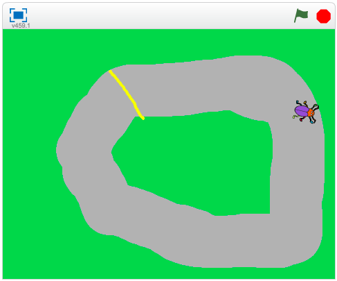

# Bug Race (intro)

Nu ska du få  skapa ett roligt spel som är enkelt även om du aldrig har jobbat med Scratch tidigare. Målet är att få en skalbagge att springa runt en bana och försöka undvika att hamna utanför banan genom att styra med vänster- och högerpil på tangentbordet. Ramlar figuren utanför banan blir du Game Over!

Ett exempel på det färdiga spelet kan du se <a href="https://scratch.mit.edu/projects/27697024/" target="_blank">här på Scratch</a>. Kanske ditt kommer se lite annorlunda ut, men grunderna för hur du bygger spelet skapar du om du följer instruktionerna i denna guide.

Nu ska vi börja koda spelet! Klicka dig fram genom denna guide, steg för steg på de gröna knapparna här under (om du inte har skrivit ut instruktionen på papper). Öppna även <a href="https://scratch.mit.edu" target="_blank">verktyget Scratch</a> där du kodar och skapar själva spelet utifrån våra instruktioner. 
> Tips: lägg gärna två fönster bredvid varandra på din datorskärm, ett fönster med Kodbokens instruktioner och ett annat med Scratch verktyg. Om det blir för litet och trångt på skärmen kan du kan testa att öppna Kodboken och Scratch som två olika flikar (Tabs) att växla mellan medan du skapar.

Då börjar vi! Klicka fram nästa sida i vår guide här nedan på grön cirkel med siffran 1 i.

## 1: Välja en skalbagge som sprajt

En **sprajt** är alla de figurer eller andra saker du väljer att lägga in i ditt spel eller projekt i Scratch, som en katt, en boll, ett ritat träd eller annat. Alla sprajter kan styras med den kod (script) du väljer att lägga in i Scratch. I ditt nya projekt visas först en katt som enda sprajt på vit bakgrund. Nu ska vi byta ut katten mot en skalbagge, så börja med att ta bort katten och välja en ny sprajt istället. Gör såhär:

1. Tryck på **saxen** (högt uppe i mitten ovanför katten) och klicka sedan på katten så försvinner den - du har nu klippt bort den ur projektet.

    

2. Nu vill du lägga till en skalbagge istället. Tryck på knappen för **NY SPRAJT** som finns inunder den vita bakgrunden:

    

  En katalog med massa figurer dyker upp. I menyn till vänster finns en kategori som heter **"Djur"**, tryck på den. Bland alla djurbilder  hittar du skalbaggen. Tryck på den och sedan på **OK** nere till höger. Nu har du lagt till en ny sprajt.

3. Skalbaggen är ganska stor, för att spelet ska bli enklare att spela måste vi minska storleken. Tryck på förminsknings-knappen (den med pilar som pekar inåt) och sedan flera gånger på skalbaggen tills den är lagom stor (som din tummnagel ungefär).

    

    

Nu är skalbaggen klar och det är dags att rita banan som den ska springa runt på!

## 2: Färglägg bakgrunden och rita en bana

Du ska nu få färglägga spelets bakgrund och rita en bana som skalbaggen kan springa på.

4. För att ändra på bakgrunden trycker du först på den vita lilla rutan längst ner till vänster där det står **SCEN** under, så den blir markerad. Klicka sedan på fliken **BAKGRUNDER** som du finner högst upp i mitten.

    	

5. Tryck på symbolen som ser ut som en målarburk: **FYLL MED FÄRG**. Välj sen ut en färg du gillar och fyll bakgrunden med den genom att klicka på färgen du vill ha och sedan på den vita bakgrunden. Vi har valt en grön färg på bakgrunden i vårt exempelspel.

  

6. Tryck på figuren som ser ut som en **PENSEL** och välj sen en färg du vill ha för banan i spelet. Gör även penseln bredare genom att dra reglaget ända till höger, strecket ska bli tjockt. Rita nu en oval (utdragen cirkel) - gör den så stor som du kan, utan att den hamnar utanför spelets ruta! Här har vi valt en grå färg på banan.

  	

  Ungefär så här kan banan se ut. Om banan är väldigt smal kommer spelet bli väldigt svårt, skalbaggen hamnar då lätt utanför banan. Är banan bred blir spelet lite lättare! 

  

## 3: Ditt första skript

Nu när bakgrunden är färdig kan du börja skapa ditt första skript. Glöm inte att **spara** ofta!

Börja med att dra och sätta ned skalbagge-sprajten på den målade banan, där du tycker den ska stå när spelet börjar. Tryck även på SKRIPT-fliken högst upp i mitten, om den inte redan är vald.

Har du lagt märke till START- och STOPP-knappen än? Se om du kan hitta dem.
Det första du ska göra är att se till att skalbaggen rör sig när du trycker på START - som alltså är den gröna flaggan som finns högt upp. För att göra det måste du tala om för skalbaggen vad den ska göra. Du ska alltså koda och lägga till ditt första skript som säger:

"När jag trycker på START, ska skalbaggen röra sig."

Gör såhär:

7. I mitten överst hittar du flera färgglada rubriker med en massa kod-pusselbitar under. Klicka på bruna rubriken **HÄNDELSER** och välj pusselbiten som är blocket för: **"när START (gröna flaggan) klickas på"**. Ta tag i och dra detta block till skriptytan (den stora tomma ytan till höger) och släpp den någonstans där. Välj sedan mörkblå rubriken **RÖRELSE** och välj blocket **"gå 10 steg"**. Lägg detta block  under det första blocket med den gröna flaggan på scriptytan och koppla ihop de två som om de vore pusselbitar.
> Tips: om man för dem nära varandra dyker en vit kant upp, då kan man släppa så kopplar de automatiskt ihop sig vid varandra.

  

  _Tryck först på Händelser och dra sedan ut "när START klickas på" till tomma vita fönstret till höger._

  

  _Tryck på Rörelse och dra sedan ut "gå 10 steg" och placera den som på bilden._

> Testa nu vad som händer när du trycker på START. Skalbaggen flyttar sig åt höger! Det är bra, men du vill ju att skalbaggen skall röra sig framåt hela tiden när spelet startats. Hur gör du det?

8. Under rubriken **KONTROLL** finns scriptblocket **"för alltid"**. Det här är en LOOP, något som sker om och om igen, som gör att sprajten fortsätter röra sig framåt så länge spelet är igång. Dra in **"för alltid"**-loopen och lägg den direkt under **"när START klickas på"** så den hamnar runt omkring blocket **"gå 10 steg"**. Kolla på bilden nedan så ser du hur du ska göra.

  

  _För att skalbaggen ska fortsätta att gå måste du lägga "gå 10 steg" i mitten av "för alltid"-loopen. "Gå 10 steg" kommer då att upprepas för alltid - om och om igen, så skalbaggen går och går och går._

> Testa att trycka på START - alltså den gröna flaggan ovanför spelet. Nu blir det fart på skalbaggen! Prova vad som händer om du ändrar antalet steg till en lägre siffra. Klicka på siffran 10 i blocket **gå 10 steg** och skriv in en annan siffra för en hastighet som du tror är lagom för att kunna styra skalbaggen. Testa dig fram tills det känns lagom snabbt.

## 4: Sätt en Startposition

För att slippa dra tillbaka skalbaggen till startplatsen på din bana varje gång du vill spela, kan du säga åt datorn att placera den på en förbestämd plats varje gång du startar spelet. Detta kallas för att **initiera programmet**, du gör ett INIT-SKRIPT som berättar för datorn hur programmet du byggt ska starta.

Innan du gör ditt skript, flytta skalbaggen till den startposition på banan som du tycker din sprajt alltid ska börja på.

9. Under **RÖRELSE** väljer du blocket **"gå till x:__ y:__"** och koppla fast blocket direkt under **"när START klickas på"**, ovanför **"för alltid"**-loopen. De siffror (värden) som står vid X och Y är KOORDINATERNA för den startposition som du har ställt skalbaggen på - alltså en bestämd plats i ditt spels yta. 

  

Nu kommer skalbaggen automatiskt att förflyttas till sin startposition varje gång du trycker på gröna START-flaggan.

## 5: Styra skalbaggen

Nästa steg blir att göra det möjligt att styra skalbaggen, så den inte rusar rakt av banan! För det behöver du två korta skript. Ett som säger åt datorn att skalbaggen ska svänga åt höger när du trycker ned höger piltangent på datorns tangentbord, och ett annat som säger åt den att svänga vänster när du trycker ned vänster piltangent.

10. Under rubriken **HÄNDELSER** finns ett block som säger **"när mellanslag trycks ned"**. Dra in två sådana block och lägg den bredvid varandra vart som som helst fritt på skriptytan. Bredvid ordet **mellanslag** i dessa två block finns en liten svart triangel. Klicka på lilla triangeln i vardera block och välj i rullistan som kommer fram -  ändra till **vänsterpil** i det ena blocket och till **högerpil** i det andra.

11. Nu ska vi få sprajten att kunna vända sig. Under **RÖRELSE** hittar du ett block som säger **"vänd (pil vänster) 15 grader"** och ett som säger **"vänd (pil höger) 15 grader"**. Koppla fast dessa två block under blocken **"när vänsterpil trycks ned"** och **"när högerpil trycks ned"**.

  

> Testa vad som händer nu när du trycker på gröna START-flaggan. Kan du styra skalbaggen åt båda hållen med piltangenterna på tangentbordet? Går det för fort? Sänk skalbaggens hastighet i rörelse-blocket!

## 6: Ändra startriktning

Om du trycker på START igen märker du att skalbaggen behåller den riktning som den hade när du avslutade spelet sist. Kan lätt bli fel håll  och detta kan du lösa genom att lägga in ett till init-skript som säger åt datorn att skalbaggen alltid ska vara vänd åt höger när du startar spelet.

12. Under **RÖRELSE** väljer du blocket som säger **"peka i 90 riktning"**. 

> Testa vad som händer om du ändrar på värdet från 90 grader till något annat (klicka på lilla svarta triangel-pilen bredvid 90). Det står även en hjälptext i rullistan när du väljer riktning, så du vet åt vilket håll skalbaggen kommer gå.

  

## 7: Känna av när skalbaggen åker av banan

Nästa steg är att skapa ett skript som gör att skalbaggen känner av när den hamnar utanför din bana. Hur ska den kunna veta det? Det kan du lösa med ett skript som känner av vilken färg som skalbaggen rör sig över. Du behöver skapa ett VILLKOR för skalbaggen, som säger att: "**OM** skalbaggen rör vid färgen som finns utanför banan betyder det att den har åkt av banan, och **DÅ** ska spelet ta slut", alltså att spelet blir Game Over!

13. Under **KONTROLL** finns blocket "**om <> då**", dra in det till scriptytan, lägg det fritt någonstans bredvid de övriga scripten. Det här blocket säger att **OM** det som står inom **<>** händer, **DÅ** ska något annat direkt hända. Till exempel: Om skalbaggen <rör färgen grön>, säg Game Over i 2 sekunder.

14. Under **KÄNNA AV** finns blocket "**Rör färgen <> ?"**. Dra in detta block till **<>** inom blocket "**om <> då**" som du lagt på scriptytan. Tryck sedan på den lilla fyrkanten med färg i så du får fram en liten hand som symbol. Flytta sedan handen till spelets färgyta utanför banan och klicka en gång med musen - då byts färgen i den lilla fyrkanten på scriptytan och får nu samma färg som den du har i spelet utanför banan. Nu har du talat om för datorn att något ska hända när skalbaggen rör vid just denna färg.

  

15. Till sist skapar du ett skript för att spelet ska säga att det är Game Over om skalbaggen nuddar färgen utanför banan. Under **UTSEENDE** väljer du blocket **"säg Hello! i 2 sekunder"** och drar in detta block innanför **"om <**"**Rör färgen grön?> då"**". Klicka sedan på ordet "Hello!" och ändra texten till det du vill skalbaggen ska säga - till exempel Game Over.

> Testa ditt spel! Händer det något när skalbaggen nuddar färgen utanför banan? Om inte, vad tror du att det kan bero på? 

## 8: Göra klart skriptet

Något saknas för att koden ska fungera! Tänk efter: **När** vill du att datorn ska känna av om skalbaggen nuddar färgen utanför banan? Det behöver ju göras efter **varje** steg skalbaggen tar, för att inte missa om den hamnar utanför banan. Datorn måste kolla vart sckalbaggen är om och om igen, hela tiden. Därför måste du slå ihop skriptet som känner av färgen utanför banan med skriptet du gjort tidigare som får skalbaggen att röra sig - så det blir ett helt, långt skript. Gör såhär:

16. Lägg skriptet som känner av färgen utanför banan, **inuti** din "för alltid"-loop. Nu kollar datorn av om skalbaggen ramlat av banan **varje gång** innan den tar nästa steg framåt igen. Sen kollar den igen - har jag ramlat av banan? Om inte, spring vidare, kolla, spring...

17. När spelet blir Game Over ska ju allt ta slut och skalbaggen sluta springa. Under **KONTROLL** finns blocket **"stoppa detta skript"**. Stoppa in detta block längst ned inuti scriptet med **"om <> då"**. På så sätt avslutas spelet och skalbaggen stannar.

## Färdig!
Grattis, nu har du skapat ditt första spel! Det färdiga skriptet i sin helhet borde se ut ungefär så här - om du följt instruktionerna:

**Glöm inte att spara ditt projekt - och att döpa det!** Döp det gärna till uppgiftens namn Bug Race - eller hitta på ett eget namn, så att du enkelt kan hitta det igen. Du skriver in namn på spelet till vänster högt upp, där det nu står "Untitled". Spara sedan. Du måste vara inloggad för att kunna spara.

> **Testa ditt projekt**  
Visa gärna någon det som du har gjort och låt dem testa. Tryck på knappen DELA som du finner bredvid knappen för att SPARA för att andra ska kunna hitta spelet på Scratch.

## Utmaning
Saknas något? Hur skulle du vilja utveckla spelet?

Tips på hur du kan bygga vidare på Bug Race får du i nästa uppgift som heter Bug Race Tillägg, där du får bland annat tips om  hur du skapar Bug race för två spelare samtidigt, med mera.

## Frågeställningar

* Vad är en sprajt?

* Vad är en loop?

* Varför kan det vara bra att använda en loop?

* Vad är ett INIT- eller Start-Skript?

* Vad händer i spelet om sprajten har samma färg som bakgrunden?
