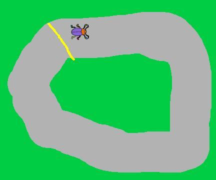
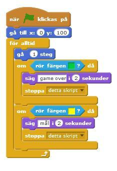
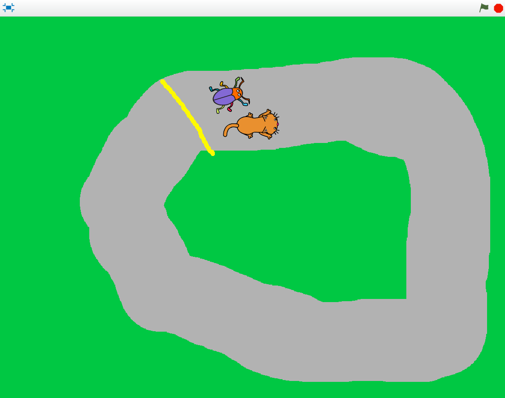
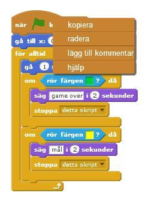
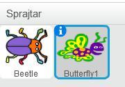
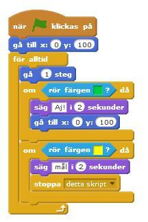
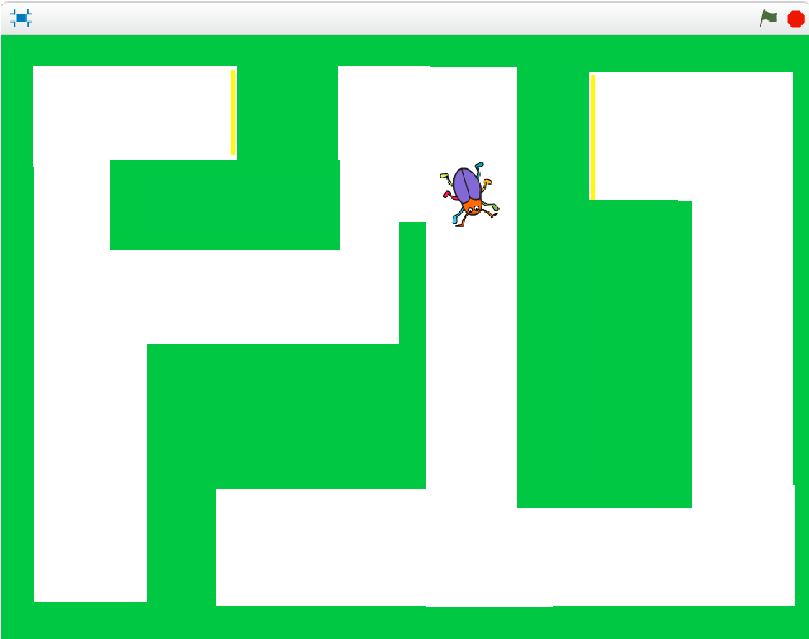
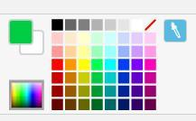

# Bug Race (tillägg)

Du har redan ett fungerande spel där du styr en skalbagge som springer runt en bana. Målet med spelet är att undvika att hamna utanför banan, då blir det Game Over. Men hur vinner du spelet?

Här finns förslag på hur du kan fortsätta med Bug Race, välj ett eller flera tillägg eller hitta på själv! Du kan behöva titta i instruktionen för _"Bug Race (intro)"_ om du har glömt hur du gjorde vissa skript.

## Tillägg 1: Mållinje för att vinna spelet

För att kunna vinna spelet behöver du en mållinje för banan och ett skript som säger att du vinner spelet när skalbaggen rör vid mållinjen. Det liknar ditt skript för att det blir Game Over när skalbaggen rör vid det gröna gräset.

1.  Börja med att rita en mållinje där du vill ha den, förslagsvis bakom skalbaggens startposition.

  

2. Skapa ett VILLKOR för skalbaggen: **om** skalbaggen rör vid färgen gul betyder det att den har nått mållinjen och **då** vinner du spelet. (Har du glömt hur du ska göra? Titta på ditt skript för Game Over.)

3. Vad ska hända **om** skalbaggen rör vid mållinjen? Den kan till exempel säga Mål! eller Grattis!
Lägg till **"stoppa detta skript"** för att avsluta spelet.

4. Lägg det nya i din **för alltid**-LOOP. Så här kan det se ut:

  

## Tillägg 2: Flera spelare

Nu har du ett spel för en spelare. Men det kan vara roligt att spela flera – eller spela med två händer! Om banan är tillräckligt bred kan du lägga till en skalbagge eller något annat djur och låta dem tävla mot varandra om vem som kommer först i mål.

1.  Börja med att lägga till en ny sprajt. Välj fritt i biblioteket eller KOPIERA skalbaggens sprajt om du vill att två skalbaggar tävlar mot varandra. Ändra storlek så att båda får plats på banan.

2. Om du har en ny sprajt som inte är kopia på den första, kan du KOPIERA SKRIPT för skalbaggen.
På så sätt behöver du inte skapa samma skript en gång till. Du kopierar genom att högerklicka överst på skriptet, välja kopiera, och dra till den nya sprajten.  Nu gör båda sprajtar samma sak!

  

3. Du behöver ändra skripten för att styra sprajten så att inte båda ska styras med vänster- och högerpil. Välj i rullistan för **"när _ trycks ned"**, till exempel tangenterna A och D.

4. Du kanske märker att din nya sprajt startar på samma ställe som skalbaggen? Du behöver ändra startposition. Flytta sprajten dit du vill att den ska stå. Du hittar sprajtens koordinater i sprajtens informationsruta, markera sprajten och tryck på "i". Ändra värden för **"gå till x: y:"**.

  

  **Testa spelet!** Nu kan du styra båda sprajtar. Men vad händer när en av dem hamnar utanför banan?

5. Om du vill kunna tävla om vem som kommer först i mål, kan det inte bli Game Over när en spelare hamnar utanför banan. Istället kan du t ex välja att sprajtarna säger "Aj!" och hamnar tillbaka på sin startposition. Så här kan det se ut då:

  

**Testa spelet!** Om det buggar och någon sprajt säger "Mål!" för tidigt kan det bero på att färgen gult finns i den nya sprajten. Testa att ändra färg då.

## Tillägg 3: Ändra banan till en labyrint

Eftersom skriptet för sprajtarna bara känner av om de rör sig på grön färg, och inte hur själva banan ser ut, är det enkelt att byta ut banan. Du kan till exempel göra en labyrint som bakgrund istället.

1. Tryck på din SCEN och gå till fliken för BAKGRUNDER. Välj **Rita ny bakgrund**.

2. Fyll först med samma gröna färg som i din första bakgrund. Du kan välja färg med färgväljaren som finns till höger om färgrutorna, tryck på den och sedan på den gröna färgen i din första bakgrund.

  

3. Gör en labyrint genom att dra upp flera vita rektanglar på den gröna bakgrunden, eller rita själv med penseln. Tänk på att banan behöver vara tillräckligt bred för att kunna spela!

4. Rita en gul mållinje i slutet av labyrinten. Tänk på att använda samma gula färg som till mållinjen du ritade i Tillägg 1. Om du inte vill ha en mållinje kan du istället rita gula bananer eller något annat som spelaren ska nå fram till.

Tips: Gör flera olika bakgrunder och se vilka som är roliga att spela med!

## Färdig!
Grattis, nu har du gjort klart tillägget!

**Glöm inte att spara ditt projekt!** Döp det gärna till uppgiftens namn så att du enkelt kan hitta den igen.

<table border="1" cellspacing="0" cellpadding="0" class="noheader" style="border-top: solid rgb(230, 63, 152);" >
	<tbody>
		<tr>
			<td>
				<strong>Testa ditt projekt</strong>
				 Visa gärna någon det som du har gjort och låt dem testa. Tryck på DELA för att andra ska kunna hitta spelet på Scratch. Gå ut till projektsidan och låt någon annan testa spelet!
			</td>
		</tr>
	</tbody
</table>

## Utmaning
Har du tid över? Här kommer en utmaning för dig som vill fortsätta:

* Flera banor
 
Kan du skapa skript som **byter scenens bakgrund** när en spelare kommer i mål – så att spelet består av flera banor?
