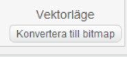
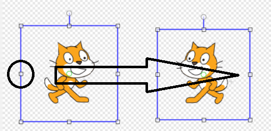
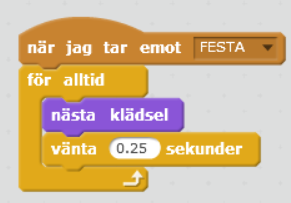
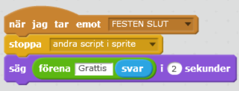
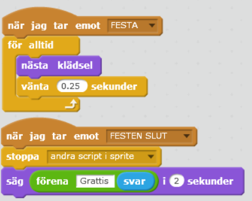
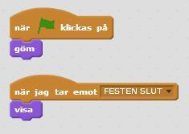
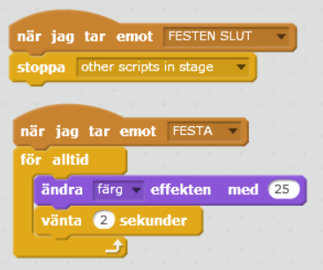
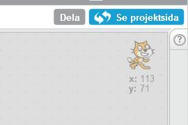

# Födelsedagskort

Här får du göra ett digitalt födelsedagskort som du kan skicka till någon som fyller år. Det är interaktivt så att födelsedagsbarnet kan skriva in sitt namn och bli personligt firad med fest, musik och tårta! Kortets tema går att ändra om du vill göra julkort eller annat.

## Delmoment 1: Välja sprajtar och bakgrund

Först behöver du en festlig **bakgrund** och några dansande **sprajtar**!

1. Tryck på **Skapa** på Scratch startsida för ett skapa ett nytt projekt.

2. Lägg till en bakgrund, till exempel **Musik och Dans > Party**.

3. Behåll katten som sprajt eller välj någon annan som huvudkaraktär. Lägg till två nya sprajtar som ska dansa på var sin sida om katten. Till exempel **Musik och Dans > Ballerina** och **Musik och Dans > Cassy Dance.** Lägg alla tre sprajtar bredvid varandra på **scenen** med utrymme för att dansa.

Nu har du dansare och bakgrund till festen. Nästa steg är att få födelsedagskortet att:

* Fråga vem som fyller år
* Spela upp en födelsedagssång
* Få alla att dansa på sitt eget sätt
* Säga grattis till födelsedagsbarnet

## Delmoment 2: Fråga efter födelsedagsbarnets namn

Vi börjar med första steget! Du ska få katten att fråga vem som fyller år.

4. Gå till kattens sprajt och skapa ett skript som startar när START-flaggan klickas på. Välj **KÄNNA AV**: **"Fråga ___ och vänta"** och skriv in "*Vem fyller år?"*.

*När du har skrivit in ett namn i rutan, tryck på Enter.
Du kommer att förstå senare vad namnet ska användas till!*

**Testa ditt projekt!** Klicka på START. Frågar katten "Vem fyller år?"? Kan du skriva ett svar på frågan i rutan?

## Delmoment 3: Katten kan dansa!

Nu vill du ge katten några dansrörelser. Du ska få lära den att dansa twist! Katten ska vända sig fram och tillbaka, så du behöver skapa en ny **klädsel** åt katten.

5. Klicka på kattens sprajt och gå till fliken KLÄDSLAR. Ta bort _Costume2_. Kopiera _Costume1_ med stämpeln, så att du har två likadana klädslar.

  

6. Välj kopian som nu heter _costume2_ och välj "Konvertera till bitmap" under **vektorläge** längst nere på höger sida.

  

7. Markera katten med markeringsverktyget:

  

8. Klicka på markeringens vänstra lilla kvadrat och dra hela bilden över till andra sidan, så att den blir spegelvänd.

  

  Nu har du två klädslar som du kan animera för att skapa en dans, men du behöver en melodi som katten kan dansa till.

9. Gå till fliken LJUD och välj t ex ljudet **Musikloopar > Birthday **från biblioteket. Prova att spela genom att trycka på **play** knappen!

  

  _Tips: Om du inte hör någonting så kanske du har stängt av ljudet eller har hörlurar inkopplade, fråga någon vuxen om hjälp om du inte kan sätta på ljudet!_

10. Gå till fliken SKRIPT och ändra skriptet som du skapade i Delmoment 2. Det ska nu:

  * Starta när START-flaggan klickas på
  * Fråga _"Vem fyller år?"_ och vänta på svar
  * **Skicka** meddelandet _"Festa"_
  * **Spela ljudet** _Birthday_ tills det har spelats färdigt

  

  _Meddelandet "Festa" kommer att bli viktigt
om en stund. Kan du lista ut varför?_

1. Skapa nu ett nytt skript till katten som ska:

  * Starta när det **tar emot meddelandet** _"Festa"_
  * **För alltid**:
    * Byta till **nästa klädsel**
    * **Vänta 0.25 sekunder**

  

**Testa ditt projekt!** Spelas ljudet efter att du har skrivit in ett namn? Dansar katten lagom fort eller går det för snabbt eller långsamt? Testa att byta ut hur länge den ska vänta mellan klädselbyte.

## Delmoment 4: Festens slut

Som du kan se så slutar inte katten att dansa fast att melodin är slut. Det kan du fixa med ett nytt **meddelande** som berättar att festen är slut, så att katten kan säga "*Grattis"* och sluta dansa.

12. Gör så att skriptet du gjorde i steg 10 skickar ut **meddelande** _"FESTEN SLUT"_ efter att ljudet _Birthday_ har spelats.

  Skapa ett nytt skript för katten som ska:

  * Starta när det **tar emot meddelande** _"FESTEN SLUT"_
  * **Stoppa** alla _andra skript i sprite_
  * **Säga** _"Grattis"_ och **namnet du skrev in i början** i 2 sekunder!

  Exempel: _"Grattis Jasmine"_. Men tänk på att du ska kunna skriva in olika namn och ändå få ett personligt grattis!

  

  _Kan du läsa steg för steg vad detta skript gör?_

**Testa ditt projekt!** Slutar katten och dansa när melodin är slut? Säger katten _"Grattis …"_ och det namn som du skrev in när kortet frågade _"Vem fyller år?"_ i början?

Tips: Om den säger orden ihop så lägg till ett mellanslag efter _"Grattis"_ i skriptet!

## Delmoment 5: Alla ska dansa!

Nu vill vi att de två andra sprajtarna ska dansa också! Du ska få bestämma vad de gör när festen börjar och när festen slutar. Du kommer att få se varför **skicka **och **ta emot meddelande** är så bra att ha. Det kallas för en FUNKTION och är en del av programmet som kan anropas flera gånger och från flera olika skript i programmet.

13. Först måste du se till så att dina sprajtar har flera klädslar att byta mellan. Om de inte redan har olika klädslar som du vill använda, kan du göra på samma sätt som du gjorde med katten.

14. Nu ska du skapa två skript för vardera sprajt. Gör skriptet för en sprajt och kopiera sedan till den andra. Bestäm själv vad som händer när de **tar emot** meddelanden "FESTA" och "FESTEN SLUT".

  

  _Tips: Titta på hur du gjorde skripten för katten om du inte kommer ihåg!_

**Testa ditt projekt!** Dansar alla sprajtar nu? Dansar de i rätt hastighet? Testa att ändra antalet sekunder som de väntar innan byte av klädsel.

## Delmoment 6: Partystämning och tårta

Du har dansare och musik, men det är inget riktigt födelsedagsfirande utan en tårta! Tårtan ska få dyka upp i slutet av animationen. Du kan också skapa partystämning genom att byta färg på scenen i takt med musiken.

15. Börja med tårtan. Lägg till sprajten **Saker > Cake** från biblioteket och ställ på scenen.

16. Skapa ett skript för tårtan som säger att den ska **gömma** sig när START klickas på, och ett skript som säger att den ska visa sig när den tar emot meddelandet "FESTEN SLUT".

  

17. Nu när vi har gjort en tårta så ska vi se till att scenen blir mer festlig genom att se till att den byter färg. Klicka på SCEN och gå till skript-fliken för. Skapa ett skript för när scenen tar emot meddelandet "FESTA" och ett för "FESTEN SLUT".

18. Skriptet för "FESTA" ska använda en LOOP som gör att scenen **för alltid** ska:

  * **Ändra** _färg_ **effekten med** _25_
  * **Vänta** _2_ **sekunder**

19. Skriptet för "FESTEN SLUT" ska:

  * **Stoppa** alla _andra skript i sprajt_

  

  _Testa att ändra antal sekunder för vänta och
värdet för färgeffekten och se vad som händer!_

**Testa ditt projekt!** Kommer det upp en tårta när katten säger _"Grattis …"_? Ändrar scenen färg? Slutar den ändra färg när melodin är slut?

**Nu har du gjort klart animationen!** Om du vill kan du göra utmaningen innan du avslutar uppgiften.

## Utmaning: Unika sprajtar

Kan du ändra i skripten för dina sprajtar så att de blir mer olika och roliga? Testa till exempel att:

* Ändra färgeffekt under dansen
* Ändra storlek på sprajten
* Lägg till rotation så att de vrider på sig
* Ändra hur fort dom dansar

Kan du hitta fler sätt att göra dom mer unika?

**Glöm inte att spara ditt projekt!** Döp den till uppgiftens namn så att du enkelt kan hitta den igen.

Tryck på DELA för att andra ska kunna hitta spelet på Scratch. Gå ut till projektsidan och låt någon annan **testa spelet!**

