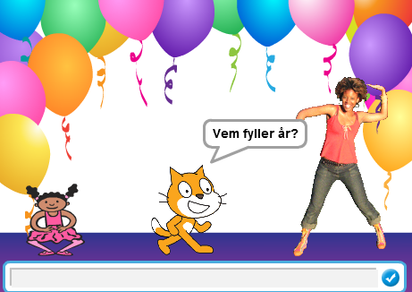
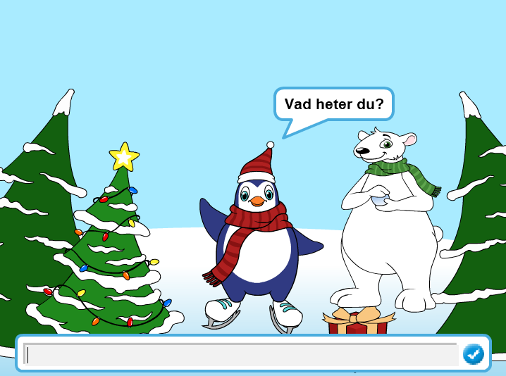
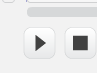
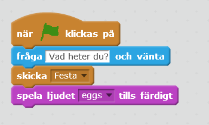
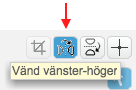
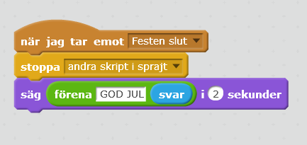
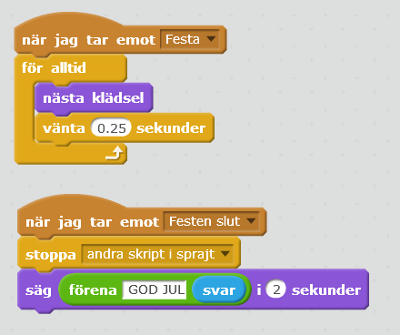
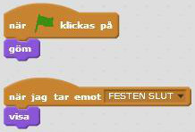

# Julkort

Här får du göra ett digitalt julkort som du kan skicka till någon du vill hälsa God Jul till. Det är interaktivt så att mottagaren av kortet  kan skriva in sitt namn och bli personligt julfirad med fest, musik och julklappar! Kortets tema går att ändra om du vill göra födelsedagskort eller annat. Ett mål med uppgiften är att du skall lära dig att använda meddelanden och funktioner.
Här kan du se ett exempelprojekt på ett julkort: https://scratch.mit.edu/projects/266913274/ 

> Bläddra dig fram genom denna guide, steg för steg. <a href="https://scratch.mit.edu" target="_blank">
  Öppna även verktyget Scratch på sajten www.scratch.mit.edu</a> där du kodar och skapar själva spelet utifrån Kodbokens instruktioner.
  
  Då börjar vi koda!

## 1: Välja sprajtar och bakgrund

Först behöver du en vintrig **bakgrund** och några juliga **sprajtar** som figurer!

1. Tryck på **Skapa** på Scratch startsida för ett skapa ett nytt projekt.

2. Lägg till en bakgrund, till exempel **Natur > Winter**.

3. Klipp bort sprajten katten genom att klicka en gång på saxen högst upp och sen en gång på katten, så förvinner den.

3. Välj en ny sprajt som huvudkaraktär i ditt julkort. Vi har valt en pingvin med tomteluva **Djur > Penguin3**, men du kan välja vad du vill såklart.

4. Lägg in två till sprajtar som ska dansa på var sin sida om pingvinen. Till exempel **Saker > Tree-lights** och **Djur > Bear1.** Lägg alla tre sprajtar bredvid varandra på **scenen** med utrymme för att dansa.

Nu har du dansare och bakgrund till festen. Nästa steg är att få julkortet att:

* Fråga mottagaren : Vad heter du?

* Spela upp musik

* Få alla sprajtar att dansa på sitt eget sätt

* Säga God Jul till mottagaren av kortet

## 2: Fråga efter mottagarens namn

Vi börjar med första steget! Du ska få pingvinen (eller den sprajt du bytt ut till) att fråga vad kortets mottagare heter.

4. Välj pingvinens sprajt och skapa ett skript till den som säger:

  * Startar när START-flaggan klickas på.

  * Välj **KÄNNA AV**: **"Fråga ___ och vänta"** och skriv in "*Vad heter du?"*.

  

*När du har skrivit in ett namn i rutan, tryck på Enter.
Du kommer att förstå senare vad namnet ska användas till!*

> Testa ditt projekt! Klicka på START. Frågar pingvinen "Vad heter du?"? Kan du skriva ett svar på frågan i rutan?

## 3: Pingvinen kan dansa!

Nu vill du ge pingvinen några dansrörelser till musik. 

1. Gå till fliken LJUD och välj t ex ljudet **Musikloopar > Eggs** från biblioteket. Prova att spela genom att trycka på **play** knappen!

  

  > **Tips:** Om du inte hör någonting så kanske du har stängt av ljudet eller har hörlurar inkopplade, fråga någon vuxen om hjälp om du inte kan sätta på ljudet!

8. Gå till fliken SKRIPT och ändra skriptet som du skapade i uppgift 2. Det ska nu:

  * Starta när START-flaggan klickas på

  * **Fråga** _"Vad heter du?"_ och vänta på svar

  * **Skicka** meddelandet _"Festa"_

  * **Spela ljudet** _Eggs_ tills det har spelats färdigt

  

  _Meddelandet "Festa" kommer att bli viktigt
om en stund. Kan du lista ut varför?_

9. Skapa nu ett nytt skript till pingvinen som ska:

  * Starta när det **tar emot meddelandet** _"Festa"_

  * **För alltid**:

    * Byta till **nästa klädsel**

    * **Vänta 0.25 sekunder**

  

> Testa ditt projekt! Spelas ljudet efter att du har skrivit in ett namn? Dansar pingvinen lagom fort eller går det för snabbt eller långsamt? Testa att byta ut hur länge den ska vänta mellan klädselbyte.

  > **Tips:**  Saknar din sprajt olika klädslar. Då kan du skapa nya klädslar enklast såhär - och få din sprajt att dansa twist!
  
  Klicka på din sprajt och gå till fliken KLÄDSLAR.

1. Kopiera _Costume1_ med stämpeln, så att du har två likadana klädslar.

  

2. Välj kopian som nu heter _costume2_ och klicka på knappen för att "vända vänster-höger" som du hittar i övre, högra hörnet.

  

  Nu har du två klädslar som du kan animera för att skapa en dans.

## 4: Festens slut

Som du kan se så slutar inte pingvinen att dansa fast att melodin är slut. Det kan du fixa med ett nytt **meddelande** som berättar att festen är slut, så att pingvinen kan säga "*GOd JUL"* och sluta dansa.

1. Gör så att skriptet du gjorde i steg 1 skickar ut **meddelande** _"FESTEN SLUT"_ efter att ljudet _Eggs_ har spelats.

2. Skapa ett nytt skript för pingvinen som ska:

  * Starta när det **tar emot meddelande** _"FESTEN SLUT"_

  * **Stoppa** alla _andra skript i sprajt_

  * **Säga** _"GOD JUL"_ och **namnet du skrev in i början** i 2 sekunder!

  **Exempel:** _"GOD JUL Jasmine"_. Men tänk på att du ska kunna skriva in olika namn och ändå få ett personligt grattis!

  

> Testa ditt projekt! Slutar Pingvinen att dansa när melodin är slut? Säger pingvinen _"GOD JUL …"_ och det namn som du skrev in när kortet frågade _"Vad heter du?"_ i början?

**Tips:** Om den säger orden ihop så lägg till ett mellanslag efter _"GOD JUL"_ i skriptet!

## 5: Alla ska dansa!

Nu vill vi att de två andra sprajtarna ska dansa också! Du ska få bestämma vad de gör när festen börjar och när festen slutar. Du kommer att få se varför **skicka** och **ta emot meddelande** är så bra att ha. Det kallas för en FUNKTION och är en del av programmet som kan anropas flera gånger och från flera olika skript i programmet.

11. Först måste du se till så att dina sprajtar har flera klädslar att byta mellan. Om de inte redan har olika klädslar som du vill använda, kan du göra på samma sätt som du gjorde med pingvinen.

12. Nu ska du skapa två skript för vardera sprajt. Gör skriptet för en sprajt och kopiera sedan till den andra. Bestäm själv vad som händer när de **tar emot** meddelanden "FESTA" och "FESTEN SLUT".

  

  **Tips:** Titta på hur du gjorde skripten för pingvinen om du inte kommer ihåg!

> Testa ditt projekt! Dansar alla sprajtar nu? Dansar de i rätt hastighet? Testa att ändra antalet sekunder som de väntar innan byte av klädsel.

## 6: Julstämning och julklappar

Du har dansare och musik, men det är inget riktigt julfirande utan en julklapp! Julklappen ska få dyka upp i slutet av animationen. Du kan också skapa julstämning genom att exempelvis byta färg på scenen i takt med musiken eller lägga in julmusik.

13. Börja med julklappen. Lägg till sprajten **Semester > Gift** från biblioteket och ställ på scenen.

14. Skapa ett skript för julklappen som säger att den ska **gömma** sig när START klickas på, och ett skript som säger att den ska **visa** sig när den **tar emot meddelandet** "FESTEN SLUT".

  

15. Nu när vi har gjort en julklapp så ska vi se till att scenen blir mer julpyntad genom att se till att scenen ändrar färg. Klicka på SCEN och gå till skript-fliken. Skapa ett skript för när scenen tar emot meddelandet "FESTA" och ett för "FESTEN SLUT".

16. Skriptet för "FESTA" ska använda en LOOP som gör att scenen **för alltid** ska:

  * **Ändra** _färg_ **effekten med** _25_

  * **Vänta** _2_ **sekunder**

17. Skriptet för "FESTEN SLUT" ska:

  * **Stoppa** alla _andra skript i sprajt_

  

> **Testa ditt projekt!** Kommer det upp en julklapp när pingvinen säger _"GOD JUL …"_? Ändrar scenen färg? Slutar den ändra färg när melodin är slut?

## Färdig!
Grattis, nu har du gjort klart uppgiften.

**Glöm inte att spara ditt projekt!** Döp det gärna till uppgiftens namn så att du enkelt kan hitta den igen.

> **Testa ditt projekt**  
Visa gärna någon det som du har gjort och låt dem testa. Tryck på DELA för att andra ska kunna hitta spelet på Scratch. Gå ut till projektsidan och låt någon annan testa spelet!

## Utmaning
Har du tid över? Här kommer en utmaning för dig som vill fortsätta.

### Unika sprajtar
Kan du ändra i skripten för dina sprajtar så att de blir mer olika och roliga? Testa till exempel att:

* Ändra färgeffekt under dansen

* Ändra storlek på sprajten

* Lägg till rotation så att de vrider på sig

* Ändra hur fort dom dansar

Kan du hitta fler sätt att göra dom mer unika?

## Frågeställningar

* Hur är denna uppgift en berättelse?  

* Vad för block kan du använda för att få spelaren att ge ett svar på en fråga?

* Vad är ett meddelande?

* Vad kan du använda ett meddelande till?
