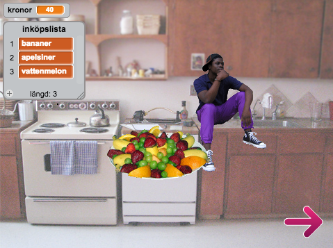
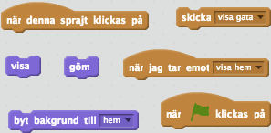
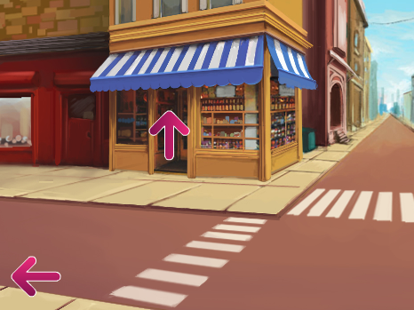
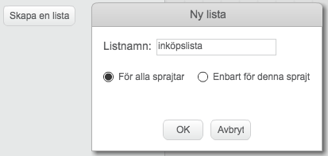
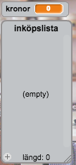
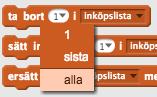
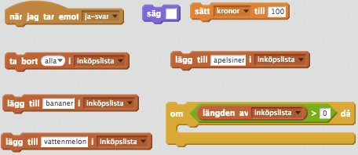
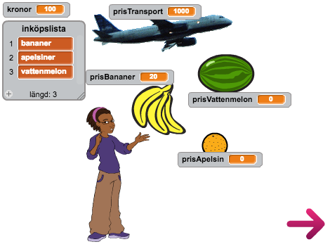
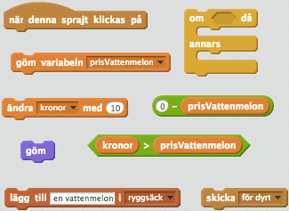
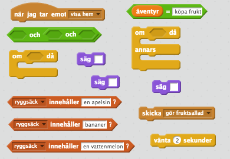

# Fruktsalladsäventyret

I den här uppgiften ska du få koda ett äventyrsspel! Du kommer att få skapa en liten affär där användaren kommer kunna köpa lite varor som han har fått i uppgift att handla till en fruktsallad. Även om det är frukt till en fruktsallad i det här exemplet kan du göra ett helt annat äventyrsspel, till exempel ingredienser till pankakor eller brädor till en koja. Det blir mycket kodande, många sprajts och så kommer du att få lära dig att använda listor.

Ett exempel på hur  spelet kan se ut ser du här: <a href="https://scratch.mit.edu/projects/116997344/" target="_blank">https://scratch.mit.edu/projects/116997344/</a>

## 1: Röra sig mellan bakgrunder

Du ska börja med att skapa **3 bakgrunder** och sedan koda så att spelaren kan ta sig mellan bakgrunderna med hjälp av olika pilar. Du ska också få skapa en sprajt som är den spelkaraktären som ger uppdraget att handla till spelaren.

1.	Skapa ett nytt projekt och ta bort katten.

2.	**Namnge** den första **vita bakgrunden** till **"affären"**. Du ska senare rita affären, men för tillfället är den tom.

3.	Lägg till **2 bakgrunder** från biblioteket:

  * **Kitchen** – **namnge** den till **"hem"**

  * **Urban2** – **namnge** den till **"gata"**

4.	Klicka på Skript-fliken så att du kan koda ett skript för **scenen** som säger:

  * Startar när START klickas på

  * Skicka meddelandet **”visa hem”**

5.	Lägg till ett nytt skript för **scenen** som säger:

  * Startar när meddelandet **”visa hem”** tas emot

  * **Byt bakgrund** till **”hem”**

6.	**Lägg till en sprajt** som användaren kan prata med och få uppdrag av. Du kan till exempel välja **Calvrett** och sätta honom på bänken i köket.

7.	**Lägg till** sprajten **Arrow1** från biblioteket och ge den **namnet "gå-gata"**.

8.	Skapa ett skript för **gå-gata** som säger:

  * Startar när sprajten **klickas på**

  * Skicka meddelandet **”visa gatan”**

  * **Göm** sprajten

9.	Skapa ett skript för **scenen** som säger:

  * Startar när den tar emot meddelandet **”visa gatan”**

  * **Byt bakgrund** till **”gata”**

10.	Skapa ett skript för **Calvrett** (eller den sprajten du valde) som **gömmer sprajten** när den tar emot meddelandet **”visa gatan”**

11.	Se till att både **Calvrett** och **gå-gata** visas när de tar emot meddelandet **”visa hem”**

  

> Testa att klicka på START och sedan på pilen. Byts bakgrunden och sprajterna försvinner?

  

Nu ska du få göra lite fler pilar så att spelaren kan vandra omkring mellan de olika scenerna:

1.	**Kopiera** sprajten **gå-gatan** _2_ gånger så att du total har **3 pilar**.

2.	**Namnge** en pil till **”gå-hem”** och en annan **”gå-affär”**

3.	Ändra i skripten för de nya pilarna så att dem **visas** när de tar emot meddelandet **”visa gata”**.

    **Tips:** Om sprajterna inte visas på skärmen så klicka på blocken du just skapade så ska de visas.

4.	 **Ändra klädsel** för de nya pilarna så att det ser ut som om de **pekar åt olika håll**. Placera ut den på ett lämpligt ställe på gatan. Det kan se ut som i bilden ovan.

5.	Skapa ett skript för sprajten **gå-hem** som säger

  * Startar när den **klickas på**

  * Skickar meddelandet **"visa hem"**

6.	Gör det samma för sprajten **gå-affär** men skicka istället meddelandet **”visa affär”**.

7.	Skapa ett skript för sprajten **gå-gata** som **visar sprajten** när den tar emot meddelandet **”visa affär”**.

8.	Skapa två skript för sprajten **gå-hem** som **gömmer sprajten** när den tar emot meddelandena **”visa affär”** och **”visa hem”**.

9.	**Kopiera** dessa två skript till **gå-affär**.

10.	Ändra nu i **scenens skript** så att den **byter** till rätt **bakgrund** när den får meddelandet **”visa affär”**

> Testa spelet igen! Kan du nu gå mellan de olika scenerna?

## 2: Prata med Calvrett

Nu ska du gå till första scenen och skapa skript för Calvrett (eller sprajten du valde) som gör att du får i uppdrag att köpa frukt.

1.	Klicka på START så att du kan se Calvrett och köket

2.	Skapa ett skript för **Calvrett** som säger:

  * Startar när START klickas på

  * **Säger** *”Hej! Jag är jättesugen på fruktsallad! Visst vill du handla lite så jag kan göra en fruktsallad?”*

3.	Lägg till sprajten **Button2** från biblioteket och ge den **namnet ”Ja-knapp”**

4.	Gå in på **klädslar** och använd **textverktyget** för att **skriva ”ja” på knappen**. 

5.	Skapa ett skript för **Ja-knapp** som säger:

  * Startar när START klickas på

  * **Visa** sprajten

6.	Skapa ett till skript för **Ja-knapp** som säger:

  * Startar när den **klickas på**

  * Skickar meddelandet **”ja-svar”**

  * **Göm** sprajten

7.	**Lägg till en sprajt** från biblioteket och kalla den **”Nej-knapp”**. Skriv **”nej”** på den.

8.	Skapa ett skript för **Nej-knapp** som gör att den **visas** när START klickas på och **göms** när den klickas på. Ungefär som för Ja-knapp.

9.	Skapa ett skript för **Ja-knapp** och **Nej-knapp** så att de även **göms** om du **klickar på den andra knappen**. Annars kan spelaren klicka på båda och det är inte bra.

Nu är det dags att skapa en VARIABEL som håller reda på hur många kronor du har att köpa med och en LISTA som håller reda på _vad_ du ska handla. Om en VARIABEL är en låda där du kan lägga in en sak eller ett värde, är en LISTA en hel byrålåda där du kan lägga in många olika värden.

10.	Skapa en **variabel** för alla sprajter som heter **”kronor”**

11.	Skapa en **lista** för alla sprajter och kalla den **”inköpslista”.** Du hittar *listor* under fliken **Data**..

    Listan kommer att synas som en tom lista på skärmen. Du kan se en lista som en speciell variabel som **innehåller flera olika värden**, i det här fallet ska den innehålla det som **Calvrett** vill att spelaren ska handla.

    
    _Så här kommer listan att se ut på scenen_

12.	Skapa ett skript för **Calvrett** som säger:

  * Startar när han tar emot meddelandet **”ja-svar”**

  * **Säger** *”Härligt! Här får du en inköpslista och 100 kronor att handla med!”*

  * Sätter variabeln **”kronor”** till **100**

  * **Ta bort allt** i **”inköpslista”**

  

  _Om du klickar på den lilla pilen bredvid 1:an kan du välja att ta bort allt i en lista._

  * **Lägg till ”bananer”** i **”inköpslista”**

  * **Lägg till "vattenmelon"** i **”inköpslista”**

  * **Lägg till "apelsin"** i **”inköpslista”**

13.	Vad som händer när **Calvrett** tar emot meddelandet **”nej-svar”** får du bestämma och koda helt själv!

14.	**Ändra** i koden för **gå-gata** så att den bara **göms** och skickar ett meddelande om **längden på ”inköpslista” är större än 0**. Det är ju ingen idé att gå och handla om du inte vet vad som behövs.

  

> Testa spelet! Vad händer när du klickar på Ja? Vad händer när du klickar på Nej?

## 3: Skapa sprajtar för affären

Nu ska du få skapa en affär. Den kommer innehålla de varor som du behöver för fruktsalladen, men också _minst_ en annan vara. Varorna som behövs till salladen ska spelaren ha råd med, men det kan finnas andra varor som är för dyra.

1.	Starta spelet och körs tills du har gått in i affären.

2.	**Lägg till en sprajt** som ska jobba i affären och namnge den **”säljare”**. Du kan till exempel välja ett djur eller en annan människa. I biblioteket finns många alternativ.

3.	**Lägg till** dessa sprajtar från biblioteket

  * **Bananas** – **namnge** den **”bananer”**

  * **Orange** – **namnge** den **"apelsin"**

  * **Watermelon** – **namnge** den **"vattenmelon"**

  * Valfritt **transportmedel**, t. Ex. Car-bug – **namnge** den **”transportmedel”**

    **Tips:** Om du vill kan du byta ut transportmedlet mot något annat. Det viktiga för uppgiften är att det finns något som är för dyrt att handla med de pengarna spelaren fick av **Calvrett**.

4.	Skapa ett skript för **säljare** som säger:

  * Startar när START klickas på

  * **Göm** sprajten

5.	Skapa ett andra skript för **säljare** som säger:

  * Startar när den tar emot meddelandet **”visa affär”**

  * **Visa** sprajten

6.	Skapa ett tredje skript för **säljare** som säger:

  * Startar när den tar emot meddelandet **”visa gatan”**

  * **Göm** sprajten

7.	**Kopiera** dessa 3 skript till sprajterna **bananer**, **apelsin**, **vattenmelon** och **transportmedel**.

Nu ska du sätta priser på varorna:

1.	Skapa dessa **variabler** för alla sprajter

  * **"prisTransport""**

  * **"prisBananer""**

  * **"prisApelsin""**

  * **"prisVattenmelon""**

2.	Skapa ett skript för **scenen** som säger:

  * Startar när START klickas på

  * Sätt **”prisTransport”** till **5000**

  * Sätt **”prisBananer”** till **20**

  * Sätt **”prisApelsin”** till **10**

  * Sätt **”prisVattenmelon”** till **30**

3.	**Flytta variablerna** på skärmen så att de är nära varorna de hör ihop med. Då kommer de se ut som prislappar!

4.	Skapa kod i **scenen** så att **variablerna visas** på skärmen när meddelandet **”visa affär”** tas emot och så att de **göms** när meddelandena **”visa hem”** och **”visa gata”** tas emot.

  

> Testa programmet! Visas varor och priser när du kommer in i affären? Vad händer när du går tillbaka till gatan, försvinner varorna och priserna?

## 4: Köpa varor

Först ska du skapa en ryggsäck så att du kan hålla reda på allt du har handlat i affären. Sedan ska du koda så att när spelaren klickar på en vara ska den hamna i ryggsäcken om spelaren har tillräckligt med pengar.

1.	Skapa en **lista** för alla sprajterna som heter **”ryggsäck”**.

2.	Dölj listan om den är i vägen.

3.	Skapa ett skript för sprajten **vattenmelon** som säger:

  * Startar när den **klickas på**

  * OM **"kronor"** är mer än **”prisVattenmelon”** då:

    * **Ändra "kronor"** med **–”prisVattenmelon”**. Glöm inte minus tecknet!

    * **Göm** sprajten

    * **Göm** variabeln **”prisVattenmelon”**

    * **Lägg till ”en vattenmelon”** i **”ryggsäck”**

  * ANNARS:

    * Skicka meddelandet **”för dyrt”**

    

4.	**Kopiera** detta skript till sprajterna **bananer**, **apelsin** och **transport**. **Ändra ”prisVattenmelon”** på två ställen så att du jämför med rätt variabel. **Ändra** också **”en vattenmelon”** till en **”bananer”**, **”en apelsin”** och **”ett transportmedel”** för de olika sprajterna.

5.	Se till att **allt tas bort** i **”rycksäck”** och **”inköpslista”** när spelet startar. Du kan till exempel skapa ett nytt **skript för scenen**.

6.	Skapa ett skript för **säljare** som säger:

  * Startar när meddelandet **”för dyrt”** tas emot

  * **Säg** *”Den här varan har du inte råd med”* i 3 sekunder

> Testa spelet igen! Vad händer om du försöker köpa ett transportmedel? Läggs saker till i listan om du till exempel försöker köpa en banan eller en vattenmelon?

## 5: Laga fruktsallad

Nu har du gjort ett spel där du kan köpa saker till en fruktsallad. Fattas bara att du går tillbaka till **Calvrett** och ser till att han lagar den!

1. Skapa en **variabel** för alla sprajter som heter **”äventyr”**. Den behöver inte visas på skärmen.

  Denna variabel behövs för att programmet inte ska köra koden du nu ska skapa förrän spelaren har fått ett uppdrag. Den kan även användas om du utvecklar programmet vidare med andra äventyr.

2. Skapa ett skript för **scenen** som **sätter "äventyr"** till **"inget"** när spelet startar

3.	Ändra i **Calvrett skript** när han tar emot meddelandet **”ja-svar”** så att skriptet även **sätter ”äventyr”** till **”köpa frukt”**.

4.	Skapa ett skript för **Calvrett** (eller den sprajten du valde) som säger:

  * Startar när den tar emot meddelandet **”visa hem”**

  * OM **”äventyr”** = **”köpa frukt”**

    * OM **"rycksäck"** innehåller **”bananer”** och **”en apelsin”** och **”en vattenmelon”**

      * **Säg** *”Fantastiskt! Nu ska jag göra fruktsallad!”*

      * **Vänta** 2 sekunder

      * Skicka meddelandet **”gör fruktsallad”**

      * **Säg** *”Nu är fruktsalladen klar!”*

    * ANNARS:

      * **Säg** *”Det verkar som det fattas något. Har du handlat allt?”*

  

5. Lägg till sprajten **Fruit Platter** från biblioteket och ge den namnet **”Frukttallrik”**.

6.	**Göm** sprajten **Frukttallrik** när spelet startar

7.	Gör ett skript för sprajten **Frukttallrik** som säger:

  * Startar när den tar emot meddelandet **”gör fruktsallad”**

  * **Visa** sprajten

8. Gör ett skript för sprajten **gå-gata** som **gömmer** sprajten när den tar emot meddelandet **"gör fruktsallad"**. Användaren ska inte kunna gå iväg igen eftersom uppdraget är färdigt!

## Färdig!
Grattis, nu har du gjort klart uppgiften.

**Glöm inte att spara ditt projekt!** Döp det gärna till uppgiftens namn så att du enkelt kan hitta den igen.

> **Testa ditt projekt**  
Visa gärna någon det som du har gjort och låt dem testa. Tryck på DELA för att andra ska kunna hitta spelet på Scratch. Gå ut till projektsidan och låt någon annan testa spelet!

## Utmaningar

### Visa och dölj listor

 Om du visar båda listorna **”inköpslista”** och **”ryggsäck”** tar de upp väldigt mycket plats. **Skapa en knapp** som visar listorna när du klickar på knappen och som döljer listorna när du klickar på den igen.

### Animera Calvrett och fruktsalladen

Skapa en rolig animation för **Calvrett** när han gör fruktsalladen. På så sätt blir spelet lite roligare!

### Flera äventyr

Nu har du skapat ett ganska enkelt äventyrsspel. Skapa **fler bakgrunder** och koda **fler äventyr**. Till exempel kan det vara så att du behöver gå någonstans för att hämta en kniv så att **Calvrett** kan skära frukten.

## Frågeställningar

* Vad är en variabel?

* Vad är en lista?

* Vad kan du använda en lista till?
