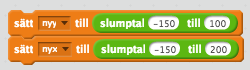

# Jakten på nyckeln

Har du någon gång letat efter en skatt? I denna uppgift ska du få koda en enklare skattjakt för din kompis. Du kommer få öva dig på koordinater som är ett sätt att ange någon eller någots position. I spelet kommer det vara skattens position som är viktig.

Så här kan det se ut:

[https://scratch.mit.edu/projects/172502923/](https://scratch.mit.edu/projects/172502923/)

## Delmoment 1 - Remixa ett projekt

Vi börjar med att remixa ett projekt som redan finns på Scratch. Detta gör att det blir enklare att komma igång. Dessutom får du två sprajtar och lite kod på köpet. Smart va?!

Öppna din webbläsare och gå till

[https://scratch.mit.edu/projects/172763192/](https://scratch.mit.edu/projects/172763192/)

Klicka på knappen **"Se inuti"** så att du kan se koden.

*Projektsidan som visas när du följer länken ovan*

Klicka sedan på knappen **"Remix"** så att du får din egen version av projektet.

*Remix-knappen markerad*

När du har remixat programmet så ser du att projektets namn har förändrats. Om du tittar under namnet ska du också se ditt eget användarnamn. Du kan döpa om projekt till något som passar bättre.

*Namnet på projektet har fått ordet "remix" på slutet*

I projektet har du nu två sprajter: 

1. En robot-sprajt som är din spelare

2. Koordinataxlar som visar x- och y-axeln.

Innan vi börjar koda ska vi först titta lite närmare på våra två sprajter och koordinatsystemet i Scratch. Varje Sprajt har en specifik position i koordinatsystemet som anges med två siffror. En som anger positionen i höger–vänster riktning och en som anger positionen i upp–ner riktning. Positionen i höger–vänster riktning kallas x–värdet och positionen i upp–ner riktning kallas y-värdet. X– och y–värdena anges på två axlar: x–axeln och y–axeln. X–axeln går mellan –240 och 240, medan y–axeln går mellan –180 och 180.

*Så här ser en markerad sprajt ut*

Om du markerar sprajten **Koordinater** så får du upp koden för denna sprajt. Det är en enkel kod som helt enkelt placerar sprajten på rätt ställe på skärmen.

Om du klickar på fliken **Klädslar** kan du se att det finns koordinatsystemet uppritat på olika sätt.

*De olika sätten att rita koordinatsystemet*

Om du klickar på klädseln **"mitten_svart"** så får du upp ett sätt att visa koordinatsystemet som du kanske känner igen bättre. I detta koordinatsystem korsar x– och y–axeln med varandra.

Det är dock lika rätt att visa koordinatsystemet som det gjordes när du remixade projektet. Klicka på klädseln **"uppe_svart"**. I detta koordinatsystem visas x–axeln överst på scenen och y–axeln till vänster i scenen. På så sätt så skyms inte så mycket av spelet av koordinatsystemet, så vi kommer använda oss av det i denna övning. Om du känner dig säkrare med “korset” så klicka på klädseln **“mitten_svart”**.

Nu ska vi kolla så att placeringen av koordinatsystemet fungerar!

*När du har musen vid –50 på x-axeln så visas koordinaterna i nedre-högra hörnet*

*Flytta musen så att den är vid siffran **–50** på **x-axeln**.

* Om du tittar i nedre högra hörnet på spelplanen så visar Scratch koordinaterna för musen. Stämmer den siffran överrens med siffran på den utritade x-axeln?

* Upprepa proceduren men flytta musen till **50** på **y-axeln**.

Klicka nu sprajten **Robot** så att den blir markerad. Koordinaten för en sprajt visas i övre högra hörnet i området med kod. Vilka koordinater har sprajten?

* Flytta omkring **Robot-sprajten** på spelplanen och se hur koordinaterna ändrar sig

* Placera **Robot**-sprajten ungefär vid **x: 0, y:0**. Denna punkt kallas *origo*, och är mitt på spelplanen.

## Delmoment 2 - Sätta bakgrund

Du ska få börja med att ladda en bakgrundsbild för spelet. Det kan vara vad du vill, men i detta exempel har vi valt en spöklik skog.

* Klicka på **Välj bakgrund** från bibliotek

* Markera en bakgrund och klicka på **Ok**

> **Tips!** Om du har valt en mörk bakgrund kan det vara svårt att se koordinatsystemet. Om det är så kan du byta färg på koordinatsystemet

* Markera **Koordinater** sprajten och klicka på fliken **Klädslar**

* Markera klädseln *uppe_vit* så blir färgen på koordinaterna vit

Så här kan spelet se ut nu!

## Delmoment 3 - Flytta roboten

Nu ska du få koda roboten så att den förflyttar sig på scenen. Det sker genom att ställa en fråga till spelaren om vilka koordinater den vill att roboten ska gå till. Markera **Robot** sprajten.

Skapa följande kod

1. När **START** klickas på

2. För alltid

    1. OM tangenten **x** är nedtryckt

        1. Fråga **"Vilken är x-koordinaten?"** och vänta

        2. Sätt x till SVAR

*Skriptet som beskrivs ovan*

Nu ska du kunna flytta roboten i längs x-axeln.

> Tryck ner **tangenten x** och testa. Kommer en ruta upp där du kan ange vilken x-koordinaten är? Förflyttar sig roboten till den x-koordinat du angav

Vi vill självklart att den ska kunna röra sig längs y-axeln så fortsätta på koden du skapade ovan. Innanför **"För alltid"**-loopen lägg följande kod

1. OM **y**-tangenten är nedtryckt

    1. Fråga **"Vilken är y-koordinaten?"** och vänta

    2. Sätt y till SVAR

*Dessa kodblock behöver du!*

> Testa programmet. Tryck ner **tangenten y**. Kommer en ruta upp där du kan ange vilken y-koordinaten är? Förflyttar sig roboten till den y-koordinat du angav

För att roboten ska starta på samma ställe varje gång så ska vi lägga in ett **Start-skript**. Precis efter blocket med **"När START klickas på"**, lägger du in följande block

1. Gå till **x:0 y:0**

> Testa spelet igen! Var hamnar roboten när spelet startar?

## Delmoment 4: Gömma nyckel  

Nu ska vi lägg till målet för spelet. En nyckel som roboten ska hitta.

1. Klicka på **"Välj sprajt från biblioteket"**

2. Markera Nyckeln och klicka på **Ok**

3. Klicka på knappen **Förminska** och sedan några gånger på **Nyckeln** så att den blir mindre.

4. Placera nyckeln på ett bra ställe på spelplanen

Skapa ett skript för nyckeln som säger

1. När START klickas på

2. Gå till **x: y:** . (De koordinater som står i detta kodblock kommer vara de koordinater som nyckeln är placerad på.)

3. Göm

*Nyckelns startskript*

Skapa ett nytt Skript för nyckeln:

1. Dra in ett block **"när jag tar emot meddelande1"** till skriptområdet

2. Klicka på den lilla **nedåtpilen** på kodblocket och klicka på **"nytt meddelande”**.

3. I rutan som dyker upp skriver du **"visa nyckeln"**.

4. Under detta kodblock lägger du in följande kod

    1. Lägg överst

    2. Visa

*Så här ska skriptet se ut till slut*

Nu kommer nyckeln att visas när den tar emot meddelandet **"visa nyckeln"**. Men när kommer det ske? Jo, när roboten är vid nyckeln. Det ska du koda nu. Vi ska säga åt roboten att när den är alldeles i närheten av nyckeln ska nyckeln visas på scenen. För att det inte ska bli allt för svårt, räcker det att roboten är 15 pixlar ifrån nyckeln.  

Markera **Robot**-sprajten. Skapa följande skript och lägg det innanför **"För alltid"**-loopen.

1. OM avstånd till **Key** är mindre än **15**

    1. Skicka meddelandet **"visa nyckeln"** och vänta

    2. Säg **"Jag hittade den!"** i 2 sekunder

    3. Stoppa alla

*Dessa kodblock behöver du*

> Testa spelet! Klicka på START och försök styra roboten så att den är vid nyckeln. Visar sig nyckeln?

> Testa spelet på en kompis! Har din kompis svårt att hitta nyckeln?

## Delmoment 5: Ledtrådar

Om du låter en kompis spela programmet nu så kommer det vara svårt att hitta nyckeln eftersom spelplanen är så stor. Därför ska vi skapa ledtrådar som gör det lite lättare att hitta nyckeln.

Det första vi ska göra är att skapa ett antalet stenar som är utplacerade på spelplanen. Under en av dessa kommer nyckeln vara gömd.

1. Skapa en **ny sprajt från biblioteket**

2. Markera **Stenarna** och klicka på **OK**.

3. Lägg den så att den är ungefär ovanför nyckeln

Skapa ett skript för denna sprajt som säger

1. När START klickas på

2. Gå till **x: y:**. Här anger du samma start-koordinater som för nyckeln. På så sätt kommer stenen vara precis där nyckeln är.

Skapa nu **minst 3 nya sprajter** som också är stenar. Placera ut dem på spelplanen, men

1. Inte för nära Roboten

2. Inte för nära nyckeln

Dessa sprajter behöver ingen kod.

Så här kan det se ut nu:

> **Tips:** Om du märker att Roboten hamnar bakom stenarna, så kan du lägga in kodblocket **"Lägg överst"** precis i början av Robotens startskript.

En annan ledtråd som vi ska skapa är att **Roboten** kommer förändra utseende om det "bränns", det vill säga om Roboten kommer i närheten av nyckeln.

**Robot** sprajten har flera klädslar som du ser om du klickar på fliken **Klädslar**.

*Robotens klädslar*

* Välj ut en klädsel som du tycker roboten ska ha när den är långt ifrån nyckeln och en klädsel som den ska ha när den är nära

* Du kan också rita på klädslarna för att göra dem olika. Här i bilden bredvid har roboten fått röda kinder.

*En robot med röda kinder*

Markera Roboten och skapa följande skript innanför **"För alltid"**-loopen.

2. OM avstånd till **Key** är mindre än **45**

    4. Byt till klädsel **Robot3**. Välj den klädsel som roboten ska ha i närheten av nyckeln.

3. ANNARS

    5. Byt till klädsel **Robot1**. Välj den klädsel som roboten ska ha långt i från nyckeln.

*Dessa kodblock behöver du*

##  Färdig!

Grattis, nu har du skapat ett nytt spel!

Glöm inte att spara ditt projekt! Döp det gärna till uppgiftens namn så att du enkelt kan hitta den igen.

> **Testa ditt projekt**

> Visa gärna någon det som du har gjort och låt dem testa. Tryck på DELA för att andra ska kunna hitta spelet på Scratch. Gå ut till projektsidan och låt någon annan testa spelet!

## Utmaningar

### Hinder på vägen

Du kan lägga till hinder i vägen för den som spelar. Då blir det lite kluriga att ta sig mellan stenarna.

1. Lägg till en sprajt, t.ex. en dinosaurie

2. I "för alltid"-loopen för **Roboten** lägg in ett skript som säger

    1. OM avstånd till **Dinosaurie** är mindre än **15**

        1. Säg **"Neeej!** I 2 sekunder

        2. Stoppa alla

Du kan lägga in flera olika sorters sprajtar.

Du kan också rita saker på bakgrunden i en särskild färg som du kan känna av om **Roboten** nuddar.

### Begränsa antalet gissningar

Nu kan spelaren gissa hur många gånger som helst. Du kan göra det lite svårare genom att koda ett maximalt antal gissningar.

1. Börja med att skapa en variabel som heter **"antal gissningar"**

2. Varje gång du flyttar Roboten ändrar du värdet på **"antal gissningar"** med 1.

3. Du får också kolla om **"antalet gissningar"** är lika med det maximala antalet som du har bestämt.

4. När detta sker så stoppar du alla skript

### Slumpmässig placering

För att göra det svårare för dig som har skapat spelet kan du placera ut stenarna och nyckeln helt slumpmässigt i början av spelet. Då får du en helt ny utmaning varje gång du spelar.

Här är några ledtrådar till hur du kan göra för att få en sten och nyckeln på samma plats:

1. Skapa en variabel som heter **"ny x"**

2. Skapa en variabel som heter **"ny y"**

3. I början av spelet sätter du dessa till slumptal.

4. Placera nyckeln på x: **"ny x"** y: **“ny y”**

5. Gör samma sak med stenen som är precis ovan stenen.

På så sätt kommer dessa två sprajter alltid vara precis ovanpå varandra. Du behöver också kolla så att nyckeln inte hamnar precis vid roboten så att spelet slutar vid starten.

## Frågeställningar

Vad är en koordinat?

Hur lång är x–axeln i Scratch?

Hur lång är y–axeln i Scratch?

Vilken koordinat har mitten på scenen?

Vad innebär det att Remixa ett projekt?

Vad är ett startskript? Varför är det bra att använda det?

Vad är ett meddelanden? Vad kan du använda det till?

Vad är en variabel? Hur kan du använda en variabel för att få input från spelaren?
