# Min hjälte deluxe – del 1

I denna uppgift får du chansen att jobba vidare med berättelsen **Min hjälte**. Du kommer få lägga till funktioner för att visa olika väder. För att göra det kommer du använda kloner, variabler och meddelanden.

Ett exempel på hur det kan se ut hittar du <a href="https://scratch.mit.edu/projects/203420852/" target="_blank">här</a>.

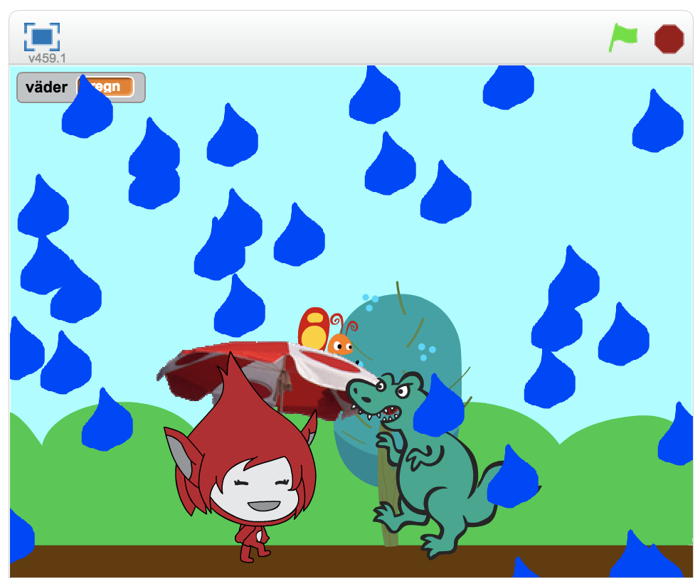

## 1 – Förberedelser

För att kunna jobba med denna uppgift måste du ha skapat en färdig berättelse **Min hjälte** som har några olika funktioner.

**Har du kodat Min hjälte?**

Om du _inte_ är klar med Min hjälte får du börja med att göra klart den. Du hittar uppgiften [här](https://www.kodboken.se/start/skapa-berattelser/uppgifter-i-scratch/min-hjalte) eller i menyn till höger.

> Nu är det dags att koda vidare på berättelsen!

## 2 – Lägg till en regndroppe

Du skall koda så att en regndroppe ramlar från toppen av skärmen ned till botten.

1. Skapa en ny, tom, sprajt genom att klicka på penseln

   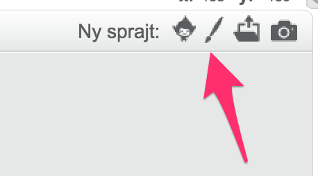

2. Måla en regndroppe

   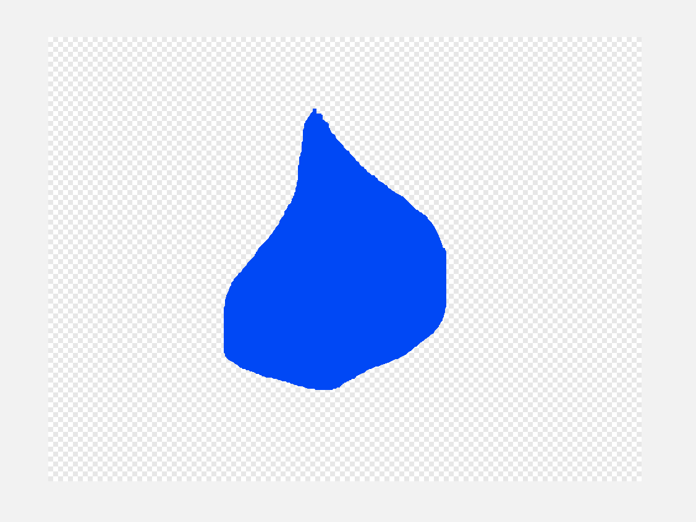

3. Minska storleken på din regndroppe genom att först klicka på knappen Förminska och sedan klicka på din regndroppe på scenen.

   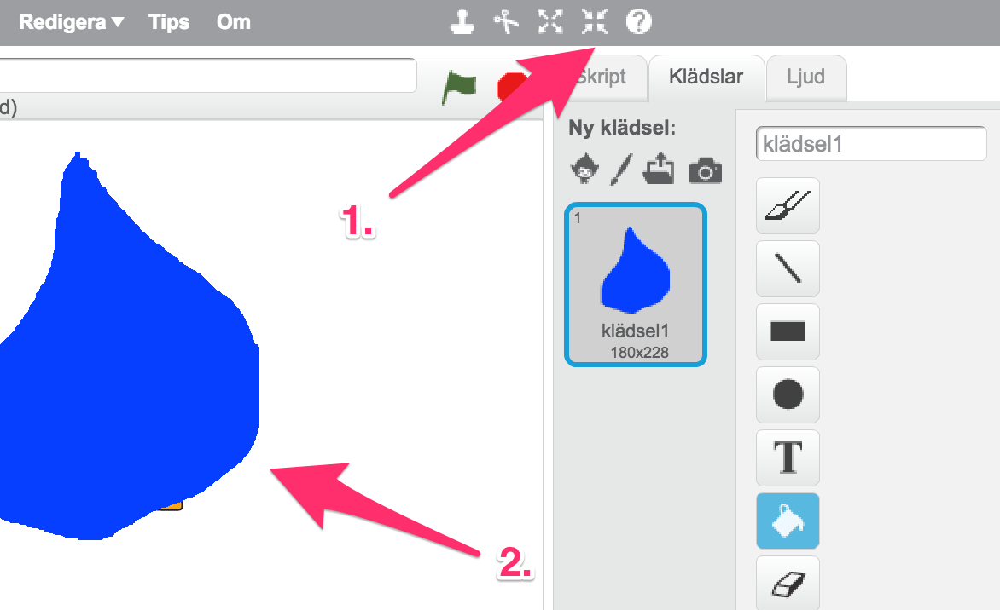

4. Nu när vi har målat en regndroppe så är det dags att få den att falla ned till botten när vi startar vår berättelse. Du behöver ett skript som säger:

   * när START klickas på
   * Sätt y till 180
   * Repetera tills y-läge < -180
     * Ändra y med -10

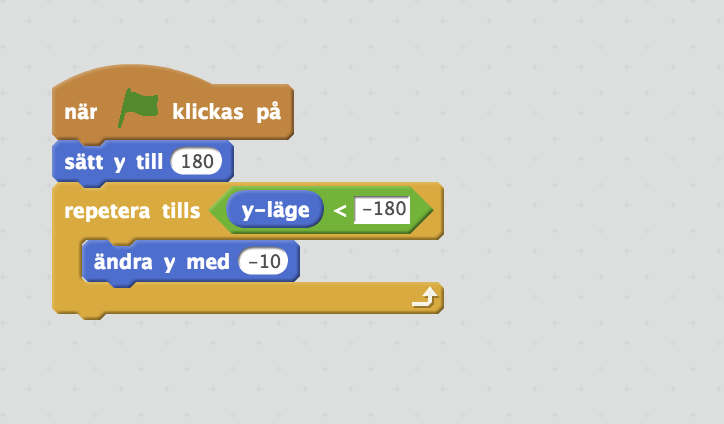

> Testa! Faller regndroppen nedåt när du trycker på START? Flyttar den sig till toppen nästa gång du trycker start?

## 3 – Skapa kloner av regndroppen så att det ser ut som att det regnar

Är det inte lite tråkigt att det bara faller _en_ regndroppe? Nu skall du koda så att det faller en massa regndroppar.

1. Under _Kontroll_ finns det ett block som heter **"när jag startar som klon"**. Dra ut det och flytta din kod från **"när START klickas på"** till **"när jag startar som klon"**.

2. Ändra koden så att den säger:

   * när jag startar som klon
   * sätt **y** till **180**
   * sätt **x** till "slumptal **-240** till **240**"
   * Repetera tills y-läge < -180
     * Ändra y med -10
   * radera klonen

3. Lägg sedan till kod under blocket **"när START klickas på"** som säger:

   * när START klickas på
   * för alltid
     * skapa klon av mig själv

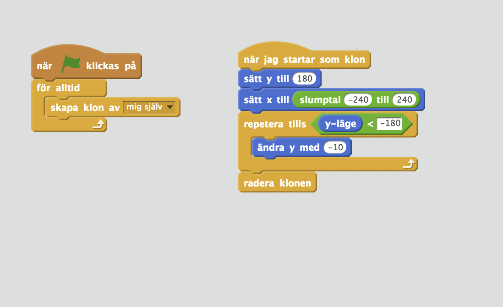

> Testa! Faller det ned en massa regndroppar nu när du trycker på START?

Ser du att en regndroppe hänger kvar uppe i taket av scenen? Det är vår _ursprungssprajt_. Vi har bara skrivit kod för hur klonerna av den här sprajten skall bete sig. Men vi har inte sagt vad som skall hända med urssprungssprajten.

1. För att bli av med ursprungssprajten: Lägg till ett block **"göm"** under **"när START klickas på"**.

2. Nu faller det inte längre några regndroppar. Det är för att en klon får samma beteende som dess ursprungssprajt och nu har vi sagt att den skall vara gömd. Lägg till ett block **"visa"** under **"när jag startar som klon"**.

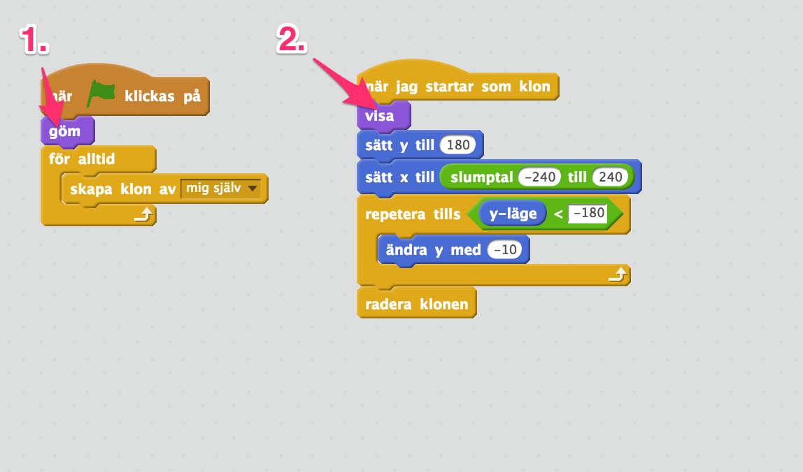

> Testa! Döljs ursprungssprajten från scenen när du trycker på START?

## 4 – Ge din hjälte ett paraply

Din hjälte blir alldeles blöt om den skall vara ute i regnet utan ett paraply. Nu skall du skriva kod för att ge hen något som skyddar mot regnet.

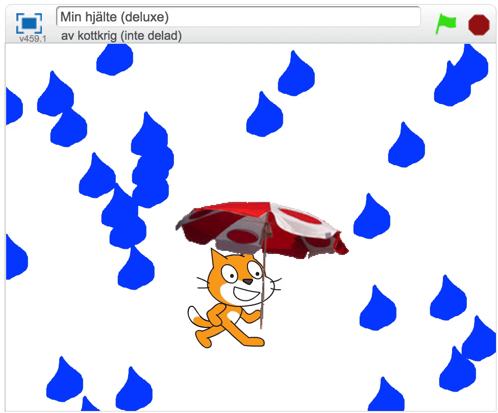

1. Lägg till en paraplysprajt från biblioteket. (Eller måla ett eget paraply i en ny sprajt genom att klicka på penseln igen)

2. Lägg till ett nytt block i koden för **när jag startar som klon**, efter att den har ändrat y med -10, som kollar om klonen rör vid paraplyet. Och om den gör det så skall klonen raderas. Du kommer behöva lägga till de här blocken:

   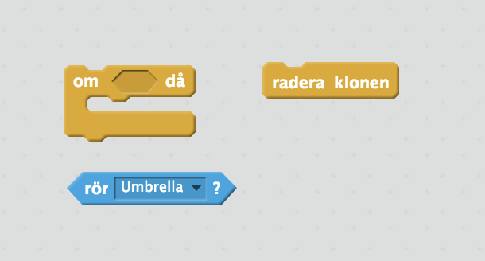

> Testa! Fungerar paraplyt?

## 5 – Slumpa vädret

I verkligheten så regnar det inte jämt. I bland är det uppehåll. Du skall nu skriva kod så att det bara regnar då och då. Men precis som i verkligheten så skall det vara svårt att förutspå vädret. Därför skall vi använda oss av slumpen.

1. Börja med att skapa en variabel för alla sprajtar som du ger namnet `väder`. Det gör du såhär:

   1. Gå till kategorin **Data**
   2. Tryck på knappen **Skapa en variabel**

      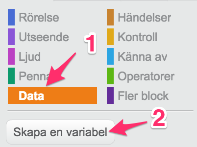

   3. Skriv in variabelnamnet `väder` och markera **För alla sprajtar**.

      

2. Ändra koden för din regndroppe så att koden för **när START klickas på** blir:

   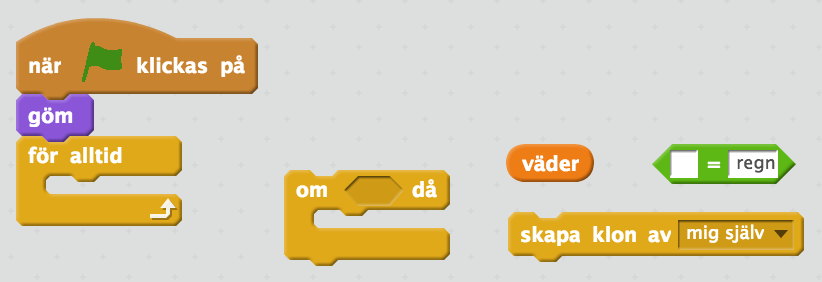

   * när START klickas på
   * göm
   * för alltid
     * om **(väder) = `regn`** då
       * skapa klon av mig själv

3. När du trycker START så kommer det inte regna längre. Det är för att vi inte har ändrat vår variabel till värdet `regn`. Det skall vi göra nu.

4. Välj scenen. Det är där du skall skriva koden för att styra vädret.

   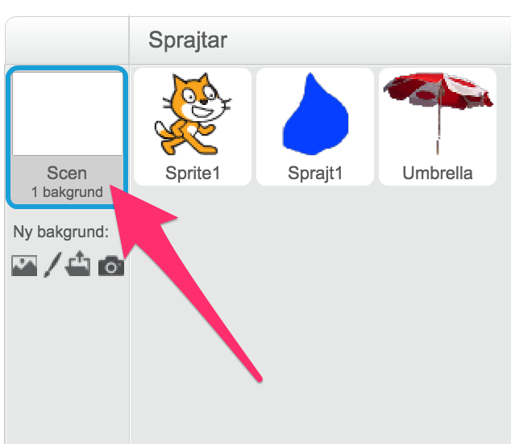

5. Lägg till ett nytt block **när START klickas på** som innehåller koden:

   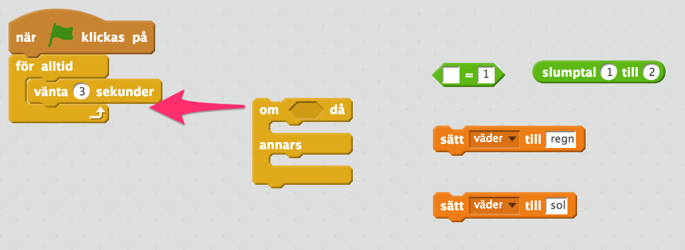

   * när START klickas på
   * för alltid
     * vänta `3` sekunder
     * om **(slumptal `1` till `2`)** = `1` då
       * sätt väder till regn
     * annars
       * sätt väder till sol

> Testa! Ändrar sig vädret? I bland kan det ta väldigt lång tid innan vändret ändras. Varför det?

## Färdig!

Snyggt jobbat, nu har du lagt till ännu fler händelser i din berättelse.

**Glöm inte att spara ditt projekt!** Döp det gärna till uppgiftens namn så att du enkelt kan hitta den igen.

> Testa! Visa gärna någon det som du har gjort och låt dem testa. Tryck på DELA för att andra ska kunna hitta berättelsen på Scratch. Gå ut till projektsidan och låt någon annan testa berättelsen!

## Utmaningar

### Dölj paraplyet när det inte regnar

Lägg till kod i paraplyt som döljer paraplyt när det är sol och visar det igen när det regnar.

### Lägg till ett nytt väder

Kan du komma på något mer väder? Kanske skulle du även kunna lägga till vind? Eller att det regnar köttbullar?

## Frågeställningar

* Vad är en variabel?
* Vad kan du använda ett slumptal till?
* Vad är en klon?
* Varför kan det vara bra att skapa kloner i stället för att bara kopiera en sprajt flera gånger?
