# Ninjaspringare

I denna uppgift ska du göra ett spel där du styr en liten ninja som kan hoppa jättehögt och sparka igenom väggar! Det kommer att se ut som om ninjan springer åt höger men det är sprajten som står still och istället är det bakgrunden som ska åka åt vänster. Den här uppgiften är för dig som gillar att rita och animera mycket.  

Ett exempel på hur  spelet kan se ut ser du här: <a href="https://scratch.mit.edu/projects/116954542/" target="_blank">https://scratch.mit.edu/projects/116954542/</a>

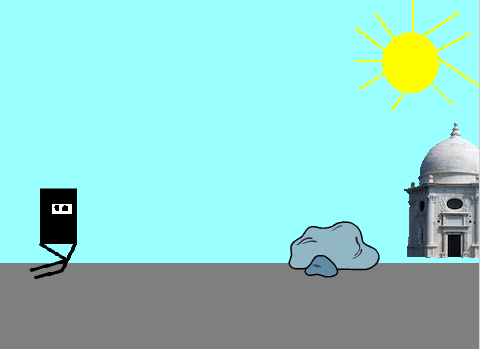

## 1: Sätta upp scen, mark och ninjan
Du börjar med att göra bakgrunden, rita mark och ninjans alla klädslar. Ninjan kommer behöva 4 klädslar till att springa, 1 till att hoppa och 1 till att sparka.

1.	Skapa ett nytt projekt och ta bort katten

2.	**Rita** en ny **bakgrund** och fyll den med färgen **blå** som himmelen. Om du vill så kan du rita en stor sol.

3.	**Rita** en ny sprajt och använd **rektangelverktyget** för att göra en rektangel på **botten av scenen**. Det är på den som ninjan kommer springa.

4.	Placera den så att den **täcker botten** av skärmen och ge den namnet **mark**.

    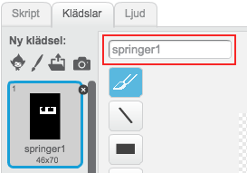

_Så här kan huvudet på ninjan se ut. Den röda rutan visar var du kan ändra namn på en klädsel._

Nu ska du rita ninjan:

1.	**Rita** en ny sprajt. Använd **rektangelverktyget** för att gör ninjans **ansikte**. Det kan se ut som bilden ovan.

2.	**Kopiera** den klädseln så att vi har **6 likadana** klädslar. Du ska lite senare rita benen på ninjan.

3.	Ge klädslarna som du just ritat **namnen** **”springer1, ”springer2”, ”springer3”, ”springer4”, ”hoppar”**, och **”sparkar”**.

4.	Ge sprajten namnet **ninja**.

    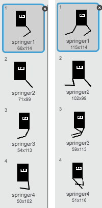

_Ungefär så här ska ninjans ben se ut. Till vänster är det **första** benet du ska rita och till höger ser du det **andra** benet också._

Nu ska vi rita ninjans ben och vi börjar med det högra:

1.	Använd **linjeverktyget** så att det blir raka linjer. Ändra **tjockleken** så benen blir lagom tjocka.

2.	När du springer så har du först **knät högt uppe**. Sedan har du **rakt ben** då du nuddar marken. Sedan när du tryckt ifrån så har du **lyft benet bakåt**. Till sists så drar du **fram benet** igen så att du kan ta ett nytt steg.

3.	**Rita** därför dessa 4 fyra **”benpositioner”** i klädslarna **”springer1”**, **”springer2”**, **”springer3”**, och **”springer 4”**. Det ska se ut ungefär som på bilden ovan till vänster.

4.	Nu ska vi rita det **andra benet** och det ska vara i marken när det första benet är i luften och tvärtom.  Använd samma **linjeverktyg** som för det första benet.

5.	I **”springer1”** ska det andra benet vara **i marken** och i **”springer2”** ska det vara **i luften**.

6.	I **”springer3”** ska du förbereda det andra benet att **ta i marken** och i **”springer4”** ska det **vara i marken** rakt fram. Det ska se ut ungefär som på bilden ovan till höger.

7.	Skapa ett skript för sprajten **ninja** som säger:

  * Startar när START klickas på

  * För alltid:

    * **Vänta** 0.2 sekunder

    * **Byt** klädsel till **”springer1”**

    * **Vänta** 0.2 sekunder

    * **Byt** klädsel till **”springer2”**

    * **Vänta** 0.2 sekunder

    *  **Byt** klädsel till **”springer3”**

    * **Vänta** 0.2 sekunder

    * **Byt** klädsel till **”springer4”**

> Testa animationen genom att klicka på den gröna flaggan! Hur ser animationen ut? Ser det ut som om ninjan springer?

Nu ska vi rita benen för de 2 sista klädslarna:

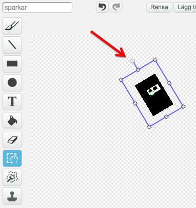

_Så här kan det se ut när du har markerat ninjans huvud. Den röda pilen pekar på där du kan rotera huvudet._

1.	För klädseln **”sparkar”** ska vi först **rotera huvudet**. Använd **markeringsverktyget** och markera ninjans huvud. **Klicka** sedan på **cirkeln** som är högst upp på markeringen för att **snurra ninjan**.

2.	Benen ska se ut ungefär så här: 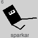

3.	För klädseln **”hoppar”** ska benen se ut ungefär så här: 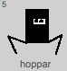

Nu är det bara 2 sprajtar till som behövs:

1.	Lägg till sprajten **Marble building** från biblioteket och ge den namnet **bakgrundshus**.

2.	Lägg till sprajten **Rocks** från biblioteket och ge den namnet **hinder**.

3.	Lägg till en **ny klädsel** för **hinder** och välj **I-pixel** från biblioteket. Detta är egentligen bokstaven ”i”, men du ska använda den som **vägg**.

4.	**Markera i:et** med markeringsverktyget och dra i den **mittersta översta lilla kvadraten**. Gör så att i:e nästan **når toppen av bildytan**. Nu ser den mer ut som en vägg.

    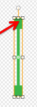

_Så här kan det se ut när du har markerat i:et. Den röda pilen pekar på där du kan ändra storleken._

## 2: Gör så att allting åker!

Nu ska du få koda så att byggnader åker sakta åt vänster så att det ser ut som om den är långt borta. Du ska också få koda på att hindret åker åt vänster, men den sprajten ska åka snabbare så att det känns som att den är närmare. _Eftersom ninjan kommer att stå stilla ser det ut som om den rör sig åt höger när det egentligen är huset och hindret som rör sig_. Häfftigt va!

1.	**Flytta** sprajten **bakgrundshus** så att **nedre kanten** är lite **ovanför** sprajten **mark**. Skriv sedan ner **y-värdet** för **bakgrundshus**.

2.	Skapa ett skript för **bakgrundshus** som säger:

  * Startar när START klickas på

  * **Gå tillbaka 3 lager**

  * För alltid:

    * **Gå** till **x: 240** **y:** (skriv in ditt egna y-värde som du skrev ner i **punkt 1**)

    * **Glid** 30 sekunder till **x: -240 y:** (samma som ovan)

3.	Klicka på sprajten **hinder** och sedan på klädseln **rocks** så att den **syns på skärmen**.

4.	**Placera** sprajten **på marken**, lite nedanför **bakgrundshus**. Skriv ner **y-värdet**.

5.	Skapa ett skript för **hinder** som säger:

  *	Startar när START klickas på

  * **Gå tillbaka 2 lager**

  * För alltid:

    * **Byt** klädsel till ett **slumptal** mellan ett **1** och **2**

    * **Gå** till **x: 240 y:** (skriv in ditt egna y-värde som du skrev ner i **punkt 4**)

    * **Glid** 5 sekunder till **x: -240 y:** (samma som ovan)

6. Skapa ett skript för **mark** som säger:

  * Starta när START klickas på

  * **Gå tillbaka 3 lager**

  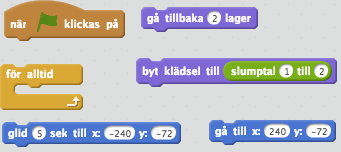

  _De här blocken behöver du för den här uppgiften. Tänk på att vissa block behöver du använda mer än en gång._

> Testa spelet! Ser det ut som att ninjan springer förbi byggnaden? Far hindren lite snabbare än huset?

## 3: Ninjan hoppar och springer

Nu ska du koda ninjan så at den kan hoppa och sparka genom väggar. Spellogiken är sådan att ninjan ska kunna hoppa över stenen men inte över väggen (i:et). För att ta sig förbi väggen behöver ninja sparka ner den.

1.	Om du vill kan du **ändra storleken** på **ninjan** med **förminskningsverktyget**. **Placera** ninjan **till vänster** på skärmen.

2.	Skapa ett skript för ninja som säger:

  *	Startar när **”uppåtpil”** trycks ner

  * **Byt** klädsel till **”hoppar”**

  * **Repetera 10** gånger: **ändra y** med **10**

  * **Repetera 10** gånger: **ändra y** med **-10**

3.	I spelet ska ninjan kunna **hoppa över stenen** men **INTE över det gröna i:et**. Därför behöver du kanske **ändra i koden** under **punkt 2**.

    * Du kan t ex ändra värdena **10** och **-10**. Det gör att ninjan åker iväg längre varje gång.

    * Du kan också ändra hur **många repetitioner** som görs.

    * Det viktiga är att **lika många repetitioner** görs på båda ställena i koden så att ninjan **hamnar på samma ställe som det den började på**.

    * **Prova dig fram** tills dess att din ninja kan hoppa över stenen men inte över i:et.

  **Tips:** Om det ändå blir för svårt att hoppa över stenen så kan du prova med att **förminska klädseln**. (Om du förminskar sprajten påverkas i:et också).

  Ett annat tips är att du kan lägga in ett **vänta 0.001 sekunder**-block efter du har **ändrat y-värdet**.

4.	Skapa ett nytt skript för ninjan som säger:

  * Startar när **”högerpil”** trycks ner

  * **Byt** klädsel till **”sparka”**

  * **Vänta 1** sekund

  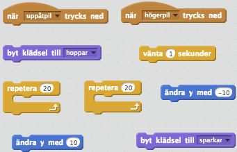

> Testa spelet! Kan du hoppa över stenen? Vad händer om du trycker på ”högerpil”? Ser det ut som om ninjan sparkar?

Tyvärr fungerar inte koden som den ska för tillfället. Koden för att animera att ninjan springer byter klädsel direkt och det ser inte ut som om ninjan sparkar alls. Detta ska du fixa nu!

1.	Lägg till blocket **stoppa andra skript i sprajt** när du byt klädsel till **”sparka”** och när du byter klädsel till **"hoppar"**.

2.	Skapa ett nytt skript för **ninja** som **startar** när den tar emot **meddelandet ”ninja spring”**

3.	**Flytta koden** som du kör när START klickas på och se till att den koden i stället körs när meddelandet **”ninja spring”** tas emot.

4.	Se till att meddelandet **”ninja spring”** skickas när START klickas på OCH efter att **”uppåtpil”** och **”högerpil”** har klickats på. På så sätt **återanvänder** du koden på att bra sätt.  

> Testa spelet igen! Börjar ninjan springa igen efter att den sparkat och hoppat?

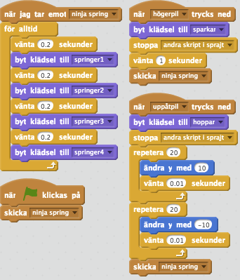

Nu ska du se till att ninjan inte kan hoppa och springa samtidigt:

1.	Skapa en **variabel** i ninja som heter **”tillstånd ninja”**.

2.	I skriptet för ninja som körs när den tar emot **meddelandet ”ninja spring”**, sätt **”tillstånd ninja”** till **”springer”**.

3.	Ändra nu i skriptet för ninjan som startar när du trycker ner **uppåtpilen** så att den bara körs OM **”tillstånd ninja”** är **”springer"** och direkt sätter variabeln till **”hoppar”**.

4.	Gör likadant i skriptet för ninjan som startar när du trycker ner **högerpilen** men sätt då **”tillstånd ninja”** till **”sparkar”**.

  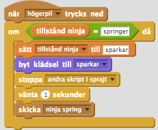

## 4: Farliga hinder

Om ninjan rör stenen så ska ninjan flyga iväg och spelet avslutas. Detsamma ska hända om ninjan springer eller hoppar på väggen. Om ninjan istället sparkar på väggen så ska den säga krasch och ninjan springa vidare. Det här ska du koda nu!

1.	Skapa ett skript för **hinder** som säger:

  * Startar när START klickas på

  * För alltid:

    * **Vänta** 1 sekund

    *	OM **rör ninja**:

    * OM **klädselnummer = 1**:

      * Skicka meddelandet **”ninja fall”**

    *	OM  **klädselnummer = 2**:

      * **Säg ”krash!”** i 1 sekund OM **”tillstånd ninja” = ”sparkar”**

      * ANNARS skicka meddelandet **”ninja fall”**

2.	Skapa ett skript i **ninja** som säger:

  * Startar när den tar emot meddelandet **”ninja fall”**

  * Sätt **tillstånd ninja** till **faller**

  * **Stoppar andra skript** i sprajt

  * **Repetera** tills **rör kant** (y > 180):

    * **Vänd 30 grader** åt höger

    * **Ändra y** med **30**

    * **Vänta** 0.1 sekunder.

  * **Göm** sprajten

3.	Du behöver sätta en startposition och startriktning på ninjan. Se till att **ninja visas och pekar i 90** riktning när spelet **börjar**. Se också till att den är **placerad på lämpligt ställe** (sätt x- och y-värdena).

    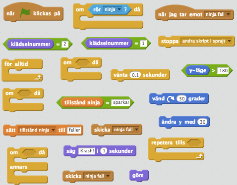

_De här blocken behöver du för punkt 1 och 2. Tänk på att vissa av blocken ska användas för **hinder** och andra för **ninja**._

> Testa spelet? Vad händer om du sparkar på en vägg? Vad händer om du landar på stenen?

## Färdig!
Grattis, nu har du gjort klart uppgiften.

**Glöm inte att spara ditt projekt!** Döp det gärna till uppgiftens namn så att du enkelt kan hitta den igen.

> **Testa ditt projekt**  
  Visa gärna någon det som du har gjort och låt dem testa. Tryck på DELA för att andra ska kunna hitta spelet på Scratch. Gå ut till projektsidan och låt någon annan testa spelet!

## Utmaningar

### Väggen faller

För tillfället händer det inte så mycket med väggen när ninjan sparkar på den. Du kan till exempel koda så att den **vänder sig** och lägger sig på marken. Eller du kan se till att den **byter klädsel**.

### Flera hinder

Du kan lägga till ett **tredje hinder** som ninjan kan **glida under**. Då behöver du rita en till **klädsel** och lägga till ett **nytt tillstånd**.

### Ljud!

Du kan lägga till olika **ljudeffekter** när ninjan hoppar, sparkar eller när väggen går sönder. På så sätt blir spelet mer levande.

### Poäng

Räkna hur många hinder du lyckas ta dig över eller sparkar ner. Använd en **variabel**.

## Frågeställningar

* Varför behövs meddelandet **"ninja spring"**?

* Hur skulle du kunnat kodat **"ninja spring"**-koden utan att ha använt dig av meddelanden?

* Varför använder du strängar, t ex "springer" och "sparkar" som värden på variabeln **"tillstånd"** i stället för nummer som 1, 2 och 3?
