# Pong

Pong är ett klassiskt spel för två spelare, men som också går att spela själv. Du styr två plattor och studsar en boll fram och tillbaka över spelplanen. Spelet var från början ett arkadspel från Atari och kom 1972. Du kommer att få lära dig att använda funktioner, slumptal och variabler.

Här kan du se en version av spelet: <a href="https://scratch.mit.edu/projects/80839730/" target="_blank">https://scratch.mit.edu/projects/80839730/</a>

## 1: Gör plattorna och en spelplan
Först behöver du göra en bakgrund och två plattor som du ska kunna styra.

1. Skapa ett nytt projekt. Ta bort katten genom att högerklicka på den och välja radera.

2. Klicka på **"Rita ny bakgrund"**.

3. Färglägg hela bakgrunden svart och rita en mållinje på vänster och höger sida, använd **rektangelverktyget** för att få dem helt raka och ganska breda. Mållinjerna ska ha olika färg, i vårt exempel använder vi röd och blå.

  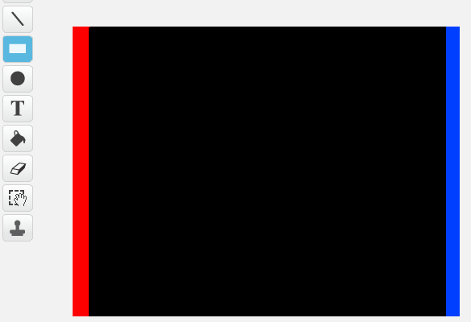

4. Klicka på **"Rita ny sprajt"** för att skapa en ny sprajt. Gör en vit avlång platta med **rektangelverktyget**.

5. Skapa en kopia av sprajten och lägg båda sprajtar framför varsin mållinje, lika nära mållinjerna.

  

## 2: Styra plattorna

Nu ska du göra ett skript för att styra plattorna och skydda din mållinje!

Du behöver använda två tangenter för att styra varje platta, uppåt och nedåt. Det får inte vara möjligt att gå utanför skärmen med din platta. Börja med sprajten vid den **blå mållinjen till höger**, och gör ett skript som låter dig styra den med tangenterna K och M.

6. Skapa ett skript som säger:

  * Starta när START klickas på

  * För alltid:

    * OM **K är nedtryckt**

      * Ändra **y med 10**

      * Studsa vid kanten

    * OM **M är nedtryckt**

      * Ändra **y med -10**

      * Studsa vid kanten

  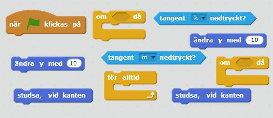

7. Gör nu samma sak för den andra sprajten, men använd två andra tangenter för att styra uppåt och nedåt. I vårt exempel används A för upp och Z för ner.

> Testa ditt projekt! Klicka på START. Kan du styra dina plattor upp och ner? Stannar dom hela tiden inom skärmen? Vad händer om dom nuddar kanten?

**Tips:** Ibland kan plattorna flippas när de studsar vid kanten, det fixar du genom att ändra **rotationsstil**. Se till att båda plattorna bara kan rotera **vänster-höger**.

## 3: En studsande boll

Nu har du gjort bakgrunden med mållinjer och plattor att styra med, nu behöver du en boll att spela med!

8. Skapa en ny sprajt genom att klicka på **"Välj en sprajt från biblioteket"**. Välj en som liknar en boll! I exemplet används **Saker/Baseball**.

9. Gör bollen till den storlek som du tycker passar, du kan alltid ändra storleken sen om det blir för enkelt eller svårt att spela.

10. Nu behöver du se till att bollen startar i mitten varje gång vi sätter på spelet, och åker därifrån åt ett slumpmässigt håll!

  Skapa ett skript för bollen som säger:  

  * Starta när START klickas på

  * Starta på positionen **x:0 och y:0**

  * **Peka i en slumpmässig riktning mellan 10 och 350 grader**. På så att rör sig bollen sedan åt ett slumpmässigt håll.

  * **Vänta 2 sekunder**, så att du hinner sätta dig bekvämt innan spelet startar

  * Därefter ska bollen **för alltid gå tio steg**, men om den **rör kanten, ska den studsa**

  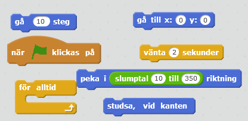

11. Nu har du en boll som studsar omkring. Fast nu behöver du se till att den kan studsa på plattorna så att du kan fånga bollen!

  Inuti **för alltid** blocket i bollens skript behöver du lägga till:

  * Kolla **om bollen rör färgen vit**, det vill säga plattornas färg, innan bollen rör sig

  * OM bollen rör färgen vit, **peka i riktningen** **360 – den nuvarande riktningen**. Då kommer bollen att studsa på ett naturligt sätt!

  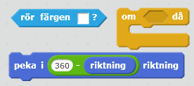

> Testa ditt projekt! Klicka på START. Studsar bollen på plattorna? Startar den i mitten? Rör den sig åt ett slumpmässigt håll varje gång du startar?

## 4: Poängsystem

Nu ska du skapa ett poängsystem för båda spelare, som räknar poäng när bollen nuddar den andra spelarens mållinje! För att göra det behöver du skapa en VARIABEL för poäng.

> En VARIABEL kan liknas vid en låda där du lägger in saker. I variabeln lägger du ett värde, t ex en siffra, som kan öka eller minska. På samma sätt kan du ta ur eller lägga i fler saker i en låda. Låter det konstigt? Snart får du se hur det fungerar.

12. Välj bollens sprajt och skapa två **variabler** från **DATA**. Den ena ska heta **Röd poäng** och den andra ska heta **Blå poäng**. Om du har valt andra färger för mållinjerna får du döpa variablerna efter dem.

13. Välj att variablerna ska vara **synliga** och placera dem högst upp på varsin sida av spelplanen.

  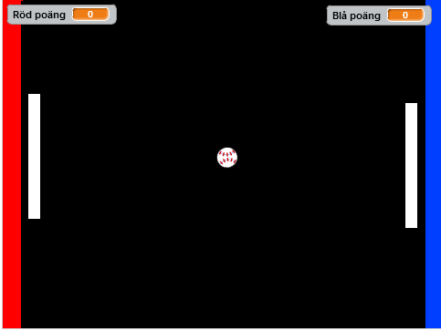

14. Gå till skriptet för bollen och lägga till:

  * Två **om** -block ovanför det vi hade lagt tidigare (som kollade om bollen rörde en vit färg)

  * Två block ovanför **för alltid**-blocket som sätter variablerna till 0 när spelet startar

  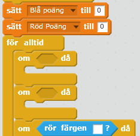

  _Där ska du ha lagt de två om-blocken och variabelblocken!_

15. Gör så att det ena **om**-blocket säger:

  * Om du **rör färgen röd** (den vänstra mållinjen)

  * **Ändra Blå poäng med 1**

  * **Gå till** mitten av planen igen **(x:0 y:0)**

  * **Vänta 2 sekunder**

  * **Peka i** en slumpmässig riktning **(slumptal 10 till 350)**

16. Gör samma sak för det andra **om-**blocket, men den ska kolla om du **rör färgen blå** (den högra mållinjen) och ska i så fall ändra **Röd poäng med 1** istället.

  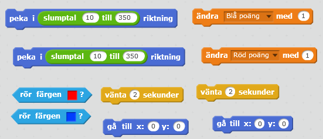

  _Här är blocken du behöver. Tänk på att om bollen rör blå färg så ska röd spelaren få poäng och vice versa!_

> Testa ditt projekt! Klicka på START. Åker bollen tillbaka till mitten när den nuddar en mållinje? Åker den i ett slumpmässigt håll då? Får rätt spelare poäng?

## 5: Game Over!

Nu när du har poängräkning så behöver du se till att det går att vinna spelet, och inte bara få poäng i en evighet!

1. Gör ett nytt skript för bollen som säger:

  * Starta när START klickas på

  * För alltid:

  * OM **Blå poäng är lika med 5** (det antal poäng man ska behöva för att vinna)

    * Säg **"Blå spelare vann!" i 2 sekunder**

    * **Stoppa alla** skript

  * OM **Röd poäng är lika med 5** (det antal poäng man ska behöva för att vinna)

    * Säg **"Röd spelare vann!" i 2 sekunder**

    * **Stoppa alla** skript

  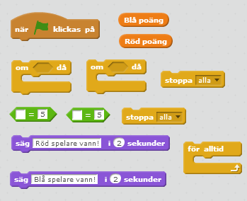

> Testa ditt projekt! Klicka på START. Stoppas spelet om någon spelare får 5 poäng?
*Du kan ändra talet 5 så att man kan vinna med färre eller fler poäng!*

## Färdig!
Grattis, nu har du gjort klart uppgiften.

**Glöm inte att spara ditt projekt!** Döp det gärna till uppgiftens namn så att du enkelt kan hitta den igen.

> **Testa ditt projekt**  
Visa gärna någon det som du har gjort och låt dem testa. Tryck på DELA för att andra ska kunna hitta spelet på Scratch. Gå ut till projektsidan och låt någon annan testa spelet!

## Utmaning
Har du tid över? Här kommer ett par utmaningar för dig som vill fortsätta.

### En timer
Om båda spelare är tillräckligt bra så kan det ta väldigt lång tid innan någon får poäng. Därför kan du göra en timer som får bollen att röra sig fortare och fortare tills någon får poäng.

1. Gör en ny **variabel** för bollen som heter "Hastighet". Välj att den inte ska synas på scenen.

2. För bollens skript, hitta alla block som har rörelse i sig och **byt ut** antalet steg, t ex **gå 10 steg**, till din variabel "**hastighet"**.

3. Gör ett nytt skript för bollen som säger:

  * Sätt "**hastighet"** till 10 varje gång du startar spelet

  * För alltid:

    * **Ändra "hastighet" med 1** **var femte sekund**

4. Du behöver också sätta tillbaka hastigheten till startvärdet varje gång en spelare får poäng. Lägg in **"sätt hastighet till 10"** för de **om-**block som kollar om bollen har **rört blå färg** respektive **röd färg**.

### Mindre plattor
Du kan även göra så att plattorna blir mindre med tiden på samma sätt som du gjorde bollen snabbare med tiden, klarar du att lista ut hur?

### Förhindra upprepade studsar

Ibland kan bollen studsa flera gånger på plattorna, vilket är onaturligt och ser konstigt ut. Här är en lösning.

Lösningen går ut på att frikoppla koden som känner av om bollen rör plattan (eller väggarna) från koden som rör bollen på skärmen. Sedan kan du fördröja upprepade kollar om bollen rör plattan tills bollen har åkt iväg.

1. Gå till koden för bollen. Ta bort blocken för **Gå __ steg** och **studsa** som du lade till ovan i en **"För alltid"**-loop.

2. Skapa ett skript för bollen som säger:

  * Startar när meddelandet ** "flytta boll"**

  * För ALLTID: **Gå 10 steg** och **studsa** vid kanten.

  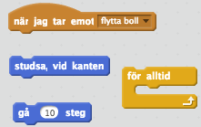

3. Se till att meddelandet **"flytta boll"** skickas precis innan spelet börjar, efter du har väntat i några sekunder.

  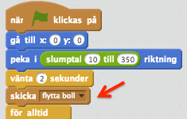

4. Nu måste vi se till att bollen stannar upp när de har träffat väggarna. Lägg därför till ett block som säger **stoppa andra skript i sprajt** precis efter du har känt efter om bollen rör röd (eller blå) färg.

5. Skicka meddelandet **"flytta boll"** efter du har väntat i två sekunder.

6. Se till att du göra båda dessa ändringar för när du känner av _"röd"_ OCH _"blå"_ färg.

  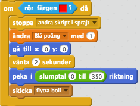

  _Så här kan koden se ut som körs när bollen rör röd färg. Tänk på att du måste köra liknande kod när bollen rör blå färg._

   Dessa ändringar frikopplar koden som känner av om bollen rör plattan från koden som rör bollen.

7. Lägg till ett skript efter du har känt av _"vit"_ färg och ändrat riktning på bollen:

  * REPETERA tills **_inte_ rör vit färg** :

    * **Vänta** 0.05 sekunder.

  Detta förhindrar att vi känner av om bollen rör plattorna upprepade gånger eftersom bollen kommer ha tid att åka bort från dem.

  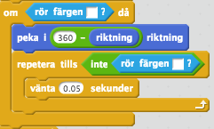

## Frågeställningar

* Vad är slumptal och vad kan du använda dem till?

* Vad är en variabel?

* Hur får du en sprajt att gå i motsatt riktning när den har träffat en annan sprajt?

* Hur kan du göra så att en sprajt inte åker utanför spelplanen när du har flyttat på den?

* Vad händer om du ändrar y-värdet på en sprajt?
