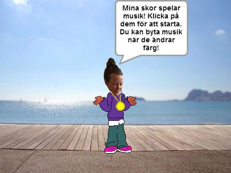
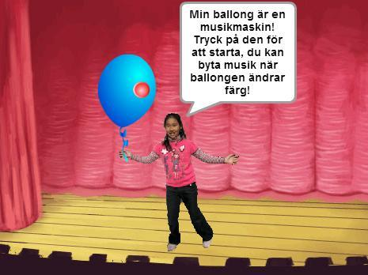
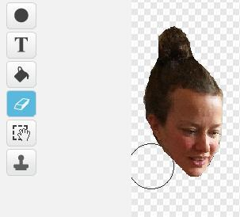
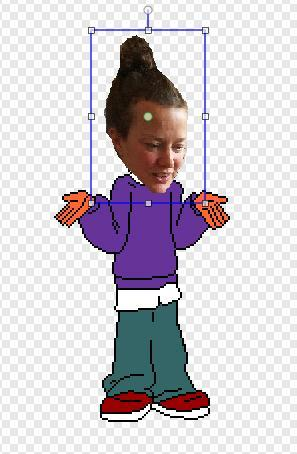
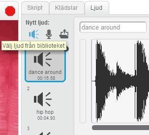
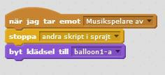
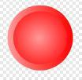
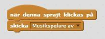

# Framtidens musikspelare

Hur vill du lyssna på musik i framtiden? Förr i tiden hade vi grammofoner, senare cd-spelare och mp3-spelare, och nu streamar många musik direkt från nätet vilket gör att du kan lyssna lite varstans. Vad vill du ha för pryl eller program som spelar din favoritmusik? Hur ska den fungera?
Det kan vara ett par musikspelande skor, ett armband, en mössa eller något helt annat – och du får animera dig själv i framtiden när du dansar till musiken!

**Här behöver du ladda upp en bild på dig själv och du behöver kunna använda ljud på datorn.**

Exempel på Framtidens musikspelare hittar du här:
* <a href="https://scratch.mit.edu/projects/83586544/" target="_blank">Exempel 1</a>

* <a href="https://scratch.mit.edu/projects/81999316/" target="_blank">Exempel 2</a>

## 1: Komma på en idé

Det första du behöver göra är att komma på vad du vill göra för musikspelare. Det är din fantasi som styr och helt upp till dig hur den ska se ut och fungera!

1. Fundera över **när** du vill kunna använda den:

  * När brukar du oftast lyssna på musik?

  * Är det utomhus eller inomhus?

  * Vad gör du samtidigt som du lyssnar på musik?

2. Fundera över hur du vill att den ska **fungera**:

  * Hur vill du styra musikspelaren: hur startar du? Hur stoppar du? Hur byter du musik?

  * Ska musiken kunna ändras beroende på något du gör, t ex hur fort du går eller vilket humör du är på?

  * Ska musikspelaren ha några helt andra funktioner som kan vara användbara?

3. Fundera över hur du vill att den ska **se ut**:

  * Vad brukar du ha på dig? Kan något av det bli en musikspelare?

  * Ska det vara något stort som du gärna visar upp, eller något litet och osynligt?

  * Vad tycker du är snyggt? Till exempel former, färger, mönster?

**Har du fått en idé för din musikspelare?** Rita eller skriv ned dina idéer, berätta gärna för någon som kan komma med förslag.

**Har du svårt att komma på en idé?** Tänk på något som du använder till vardags, som du har på dig eller med dig varje dag. Tänk inte att någon idé är dum eller fel – i framtiden kan allt vara möjligt!

**Tips:** Är det ändå svårt att komma på en idé, **Välj sprajt från biblioteket** i Scratch och se om du kan hitta något där som kan bli en musikspelare.

## 2: Ditt framtida jag

Först behöver du en *scen* för din animation och en *sprajt* som ska föreställa dig själv i framtiden. Du kommer att få klippa in en bild av ditt eget ansikte och sätta som *sprajtens* huvud – om du vill!

1. Skapa ett nytt projekt och ta bort katten.

2. **Välj sprajt från biblioteket** och ta en figur som du vill ska föreställa dig själv i framtiden. Du kan såklart även **rita** en egen *sprajt*, men väljer du en ur biblioteket finns redan flera *klädslar* att animera mellan.

3. Välj en **bakgrund** till *Scenen* som du tycker passar för att visa när du vill kunna använda musikspelaren. Är det hemma? Utomhus? På stranden? När du sportar?

4. Nu ska du få göra om *sprajten* så att den får ditt huvud! Gå till din *sprajt*, och välj **Rita ny klädsel**. Klicka på ** Importera** ovanför ritytan, och välj en bild på dig själv. (Här behöver du ha sparat en bild på din dator i förväg.)

  

5. **Sudda** ut all bakgrund från din bild, så att bara ditt huvud är kvar.  Zooma in om det är svårt att komma åt och sudda runt om. **Förminska** sedan huvudet om du tror att det behövs för att passa in på *sprajtens* kropp.

  

6. Markera ditt huvud och klicka på **kopiera**. Gå till de andra *klädslarna* för *sprajten* och **kopiera in ditt huvud** och placera ovanpå *sprajtens* huvud. Gör likadant på alla *klädslar*!

  

  

## 3: Skapa en prototyp

Nu ska du få ta din idé till musikspelare och omvandla den till en PROTOTYP i Scratch. En prototyp är en enkel testversion som du gör för att visa upp din idé. Din prototyp ska visa hur musikspelaren är tänkt att **se ut** och **fungera**, och **när** den kan användas.

6. **Rita** själv eller **välj sprajt från biblioteket** för din musikspelare. Om du vill **ladda upp sprajt** och hitta en bild på nätet, använd <a href="http://search.creativecommons.org/" target="_blank">Creative Commons sökmotor</a> för att hitta bilder som är fria att använda!

**Tips:** Om *sprajten* som föreställer dig i framtiden redan har på sig det som du vill använda som musikspelare, till exempel skor eller kläder, kan du använda det.   

Du väljer själv hur du ska kunna **starta**, **stoppa** och **byta musik** på musikspelaren. Här i exemplet startar musikspelaren när du klickar på den och du kan byta musik när den ändrar färg, vilket den gör automatiskt genom att byta *klädslar*. Varje *klädsel* ska ha en egen låt!

7. Gör ett *skript* för musikspelarens *sprajt* som **skickar meddelandet "Musikspelare på"** när du klickar på *sprajten*.

8. Gå in på fliken LJUD och **välj ljud från bibliotek**. Välj ut några olika **musikloopar** som du vill kunna byta mellan.

  

9. Gå nu in på fliken KLÄDSLAR. Om din sprajt redan har flera olika *klädslar*, till exempel olika **färger**, så kan du använda dem. Om inte: **kopiera** *sprajtens klädsel* och gör **lika många versioner som du vill ha musikloopar**. Använd FÄRGLÄGG EN FORM (färgburken) om du vill byta färg på *klädseln*.

**Tips:** Vill du kunna byta musik utan att musikspelaren ändrar sitt utseende? Gör i så fall flera *klädslar* som får se likadana ut.

Nu behöver du säga åt *sprajten* att den ska känna av om du har muspekaren på dig, samtidigt som den kollar vilken *klädsel* den har för att spela rätt ljud. För det behöver du använda en OPERATOR som säger att båda saker måste stämma för att skriptet ska utföras. Titta under fliken **OPERATORER **och se om du kan lista ut vilken du ska använda!

1. Gör ett *skript* som startar när *sprajten* tar emot **meddelandet "Musikspelare på"** och som säger:

  * **För alltid**:

    * OM *sprajten* **rör muspekaren och** den har **klädselnummer 1** då ska en viss musikloop **spelas**

    * ANNARS ska den kontrollera **om** *sprajten* **rör muspekaren och** har **klädselnummer 2** då ska en annan musikloop **spelas**

    * ANNARS ska den kontrollera **om** *sprajten* **rör muspekaren och** har **klädselnummer 3** (Och så vidare så många klädslar som du har)

    * ANNARS växlar *sprajten* till **nästa klädsel** och **väntar** en kort stund innan den börjar om

**Tips:** För att inte alla ljud ska spelas samtidigt och bli ett enda kaos, lägg in ett block som **stoppar alla ljud** innan en ny musikloop ska starta.  

  

*Så här kan ett skript se ut för att musikspelaren ska byta musik.*

> Testa ditt projekt! Klicka på START. Prova att klicka på *sprajten* för musikspelaren. Byter den *klädsel*? Vad händer när du för muspekaren över *sprajten*? Byter den musikloop? Spelar den ett ljud i taget?

## 4: Stoppa musiken

Nu ska du få bestämma hur du vill kunna stänga av musikspelaren. Eftersom du även vill ha den avstängd när du trycker på START, gör du det som ett INIT-SKRIPT som du kan använda flera ställen i ditt program.

11. Gör ett *skript* för musikspelarens *sprajt* som **skickar meddelandet "Musikspelare av"** när du klickar på START.

12. Gör ett skript för att **ta emot** **meddelandet "Musikspelare av"** och som **stoppar** alla **andra skript i sprajten** och som **byter till** den **klädsel** du vill att musikspelaren ska ha när den är avstängd.  

  

13. Nu får du göra ett *skript* för att stänga av musikspelaren, när den är igång. Här i exemplet är det en egen *sprajt* som du klickar på för att **skicka meddelandet "Musikspelare av"**.

  
  

  *Sprajten kan till exempel vara en knapp på musikspelaren.*

> Testa ditt projekt! Klicka på START. Har musikspelaren den *klädsel* du vill att den ska ha från början? Är alla ljud avstängda? Kan du starta musikspelaren? Kan du byta musik? Kan du stänga av?

## Färdig!
Grattis, nu har du gjort klart uppgiften.

**Glöm inte att spara ditt projekt!** Döp det gärna till uppgiftens namn så att du enkelt kan hitta den igen.

> **Testa ditt projekt**  
Visa gärna någon det som du har gjort och låt dem testa. Tryck på DELA för att andra ska kunna hitta spelet på Scratch. Gå ut till projektsidan och låt någon annan testa spelet!

## Utmaning
Har du tid över? Här kommer en utmaning för dig som vill fortsätta.

### Gör en dj-mixer

Om du vill fortsätta med din musikspelare kan du göra om den till en ljudmixer så att du kan vara DJ och mixa ihop ljud till egna låtar. Här får du testa dig fram med olika ljud från biblioteket, och hur du ska kunna byta mellan ljuden. Det går även att ändra **tempo** och **volym** för ljud i Scratch.

Om du inte vill skapa en ljudmixer kan du till exempel göra:

* Ett piano som spelar olika toner

* En trummaskin med olika trumljud

* Ett helt band som spelar på olika instrument

## Frågeställningar

* Vad är en prototyp?

* Varför kan det vara bra att göra en prototyp?

* Hur skulle du förbättra din prototyp om du gjorde den till ett riktig program
