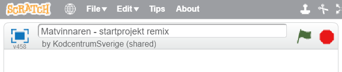

# Matvinnaren - intro

Brukar du slänga mat som du inte orkar eller vill äta upp? Det gör rätt
många av oss, i Sverige slänger vi mat som motsvarar ett utsläpp på
500 000 ton växthusgaser varje år. Det är nästan lika mycket som från
200 000 bilar!(Livsmedelsverkets siffror)

Matsvinnet slösar både miljön och pengar, och det är en utmaning som vi
alla kan hjälpas åt med. Vad skulle få dig att slänga mindre mat själv,
hemma eller i skolan? Här ska du få skapa en soptunna som talar om hur
mycket mat du slänger!

Ett exempel på hur det kan se ut hittar du här:
<a href="https://scratch.mit.edu/projects/188545076/" target="_blank">https://scratch.mit.edu/projects/188545076/</a>

Efter att du har klarat den här uppgiften kan du sedan hitta på din helt
egna app, spel eller digitala pryl som gör det roligare eller enklare
att minska på matsvinnet!

## 1: Remixa ett projekt

Vi börjar med att remixa ett projekt som redan finns på Scratch. I
startprojektet får du två sprajtar som vi har ritat åt dig, en tallrik
och en soptunna. Så kan du komma igång och koda snabbare!

Öppna din webbläsare och gå till startprojektet: <a href="https://scratch.mit.edu/projects/188522752/" target="_blank">https://scratch.mit.edu/projects/188522752/</a>

1.  Klicka på knappen **“Se inuti”** så att du kan se koden.

    

1.  Klicka sedan på knappen **“Remix”** så att du får din egen version
    av projektet.

    

När du har remixat programmet så ser du att projektets namn har
förändrats. Om du tittar under namnet ska du också se ditt eget
användarnamn. Du kan döpa om projekt om du vill!

    

I projektet har du nu två SPRAJTAR som redan finns med på SCENEN:

1.  En tallrik som maten ska ligga på

2.  En soptunna som du ska kunna slänga maten i

    

## 2: Välj sprajtar

Nu ska du få lägga till några sprajtar som du behöver! Först får du
välja tre sprajtar som kan visa en maträtt i tre delar (3/3). Du får
välja fritt, i vårt exempel har vi använt tre tacos! Sedan behöver du
välja en figur som kan äta maten också.

1.  Tryck på knappen för NY SPRAJT och välj en sprajt från biblioteket som ska vara mat. I vårt exempel har vi valt ”Taco”. Markera den sprajt du vill ha och klicka på OK. Nu syns sprajten på scenen.

    

2.  Om du vill ha tre av samma sorts mat, kopiera sprajten med **stämpel-verktyget** högst upp i mitten. Vill du istället ha tre olika matsorter, som tillsammans blir din skolmåltid, välj flera sprajtar ur biblioteket.  

    

3.  Välj också en figur som ska få äta maten – du kan välja fritt ur biblioteket. I vårt exempel har vi använt ”Pico”.

    

## 3: Bakgrund till scenen

Nästa steg är att välja en BAKGRUND till din scen. Rita själv eller välj
ur biblioteket. Hur ser din skolmatsal ut? Eller hur skulle du vilja att
en skolmatsal kunde se ut?

1.  För att ändra bakgrunden trycker du först på SCEN längst till vänster.

    

2.  Tryck sedan på knappen för VÄLJ BAKGRUND FRÅN BIBLIOTEKET. Välj vilken bakgrund du vill och tryck på OK.

## 4: Mät matsvinnet med variabler

Nu ska du göra så att soptunnan kan visa hur mycket matsvinn det blir
när du slänger maten. För att göra det behöver du skapa en **VARIABEL**
som visar hur mycket mat som slängs. Varje mat-sprajt i soptunnan ska
öka variabeln för att visa hur mycket matsvinn det blir.

En **VARIABEL** kan liknas vid en låda där du lägger in saker. I
variabeln lägger du ett värde, t ex en siffra, som kan öka eller minska.
På samma sätt kan du ta ur eller lägga i fler saker i en låda. Låter det
konstigt? Snart får du se hur det fungerar.

Nu ska du skapa en variabel som mäter hur många kilo (kg) mat som du
slänger i soptunnan:

1.  Markera soptunnan som är den sprajt som ska mäta matsvinnet. För att göra det, gå till **DATA** och tryck på **skapa en variabel**. Döp variabeln till **"*Matsvinn i kilo*”**.  

    

2.  Bocka i att variabeln ska vara **synlig** och att den gäller för **alla sprajtar**. Placera variabeln, som nu är en viktmätare på scenen, där du vill ha den. I vårt exempel har vi satt den ovanpå soptunnan!

    

3.  För att nollställa vikten när programmet startas behöver du göra ett skript för soptunnan. Markera soptunne-sprajten. Ta skriptblocket från HÄNDELSER som heter "**när START (flaggan) klickas på”** och under det fäster du skriptblocket **”sätt *Matsvinn i kilo* till 0”** från **DATA**.

    

**Testa ditt projekt! Klicka på START.** Står viktmätaren på 0 när du
startar programmet?

## 5: Väg maten som slängs

Nu ska du skapa ett skript för vad som händer när du slänger maten i
soptunnan. Här i vårt exempel är det tacosarna som talar om för
soptunnan hur mycket de väger och sedan gömmer sig så att det ser ut som
att de hamnar inuti soptunnan.

1.  Markera din första taco-sprajt (eller om du har någon annan matsort). Gå till skript och dra ut ett skriptblock "**när START (flaggan) klickas på”** från HÄNDELSER.

2.  Börja med att göra ett startskript för sprajten som säger var den ska ligga på scenen och att den ska vara synlig. Det gör du genom att dra ut ett ”**gå till x: och y:”** från RÖRELSE och ett ”**visa”**-block från UTSEENDE.  

    

3.  Nu behöver du först ta en **”för alltid”**-loop från KONTROLL. Inuti den lägger du ett block från KONTROLL som säger **om\_då**.

4.  Mellan **om** och **då** finns en ruta där du kan välja vad sprajten ska känna av. Från KÄNNA AV väljer du att känna av om sprajten **”rör soptunna?”**.

    

Vad ska hända när du drar tacosen till soptunnan? Här vill vi att
variabeln som du skapade för soptunnans viktmätare ska öka så mycket som
tacosen väger!

Till det behöver du **OPERATORER** – skriptblock som har med matematik
att göra. Med hjälp av operatorer kan du jämföra variabler, se vilka
variabler som är störst eller minst, och även använda de fyra
räknesätten på dina variabler.

Först behöver vi ett räkneexempel för att ta reda på hur mycket en
tredjedel av en vanlig portion skolmat väger:

-   En vanlig portion skolmat väger ca 360 gram, det vill säga 0,36 kg.

-   Tre tacos i vårt exempel väger därför 360 gram, alltså 0,36 kg.

-   Hur mycket väger då en taco, det vill säga 1/3 av hela portionen?

Vad en tredjedel av hela portionen blir kan du få skriptet att räkna ut,
så slipper du att räkna ut det själv!

5.  Ta ett skriptblock från DATA som säger **”ändra matsvinn i kilo med _”**.

6.  Från OPERATORER väljer du nu en **division**-operator, det vill säga en operator som kan dela två värden. Titta på bilden här under om du inte hittar den!

    

7.  Skriv in hela portionens värde, alltså **0.36** till vänster om tecknet för division (**/)** och värdet **3** till höger.

**Tips!** Tänk på att i Scratch behöver du använda punkt och inte
kommatecken för decimaler!

8.  Lägg sedan till att sprajten ska gömma sig, så att det ser ut som att tacosen försvinner in i soptunnan. Det gör du med skriptblocket **”göm”** från UTSEENDE. Så här ska skriptet se ut nu:  

    

9.  Om du vill kan du även lägga till ljudeffekter och animationer när maten slängs i soptunnan! Så här kan det se ut då:

    

10.  Lägg till ett skript som talar om vad som händer om du låter din figur äta upp maten istället! Här kan du också använda ljudeffekter och animationer. Här i vårt exempel är det när tacon rör vid Pico som den byter klädsel och spelar ett tugg-ljud:

  

**Tips:** Om du byter klädsel för att animera en sprajt, glöm inte att
ändra i startskriptet så att du startar med rätt klädsel! Se på bilden
ovan hur startskriptet behöver se ut då.

**Testa ditt projekt! Klicka på START.** Prova att dra den taco som du
har gjort skriptet för, till soptunnan. Vad händer när du slänger
tacosen? Ändrar sig viktmätaren? Stämmer vikten på en taco, är värdet en
tredjedel av 0.36?

## 6: Kopiera skriptet

Nu är du alldeles strax klar med ditt program! Men först ska du se till
så att alla taco-sprajtar har likadana skript som säger vad som händer
om de äts upp eller om de slängs i soptunnan. Du behöver inte göra om
skriptet för varje taco-sprajt, istället kan du kopiera det skript som
du redan har skapat.

1.  Du kopierar hela skriptet genom att ta tag högst upp i blocket **”när START klickas på”** och dra och släppa skriptet på de sprajtar som du vill kopiera skriptet till.

    

**Tips:** Var noga så att du inte släpper skriptet i mitten, där alla
skriptblock ligger, för då försvinner all din kod! Ta tag i skriptet och
dra det hela vägen till den sprajt som du vill kopiera till. Släpp
ovanpå sprajten.

2.  Klicka sedan på de två andra taco-sprajtarna och titta så att skriptet nu finns där också. Ser det rätt ut? Behöver du ändra något i skriptet för att det ska stämma?

**Testa ditt projekt! Klicka på START.** Vad händer när du slänger maten
i soptunnan? Ändrar sig viktmätaren? Stämmer vikten på varje taco som du
slänger? Blir det 0.36 kilo matsvinn om du slänger alla tre?

## Nu har du ett färdigt program!

Grattis, nu har du gjort färdigt uppgiften.

-   Döp ditt projekt i rutan högst upp till vänster, om du inte redan
    har gjort det.

-   Tryck på DELA högst upp till höger för att andra ska kunna hitta
    projektet på Scratch.

-   Gå ut till projektsidan och låt någon annan testa ditt program.

## Frågeställningar

-   När behöver du använda villkoret om - då i ditt program?

-   Vad är en variabel?

-   Vad kan du använda operatorer till?
