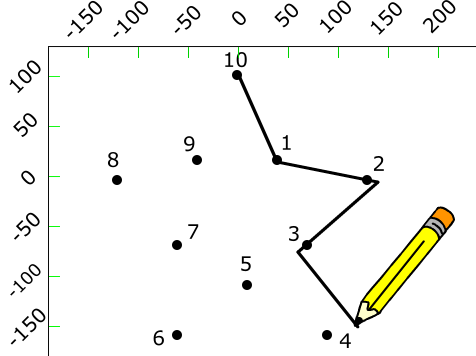
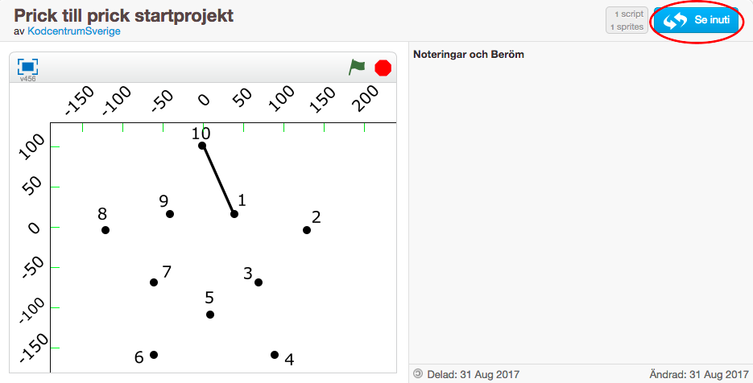
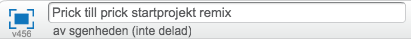
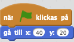
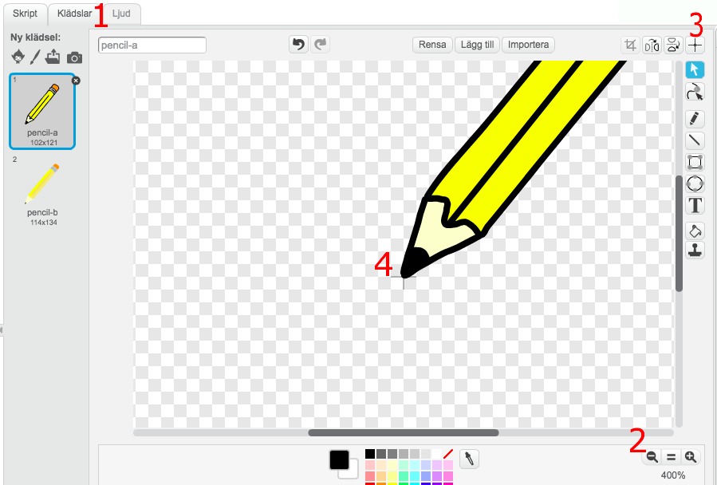
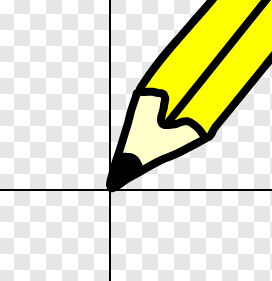
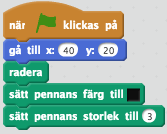
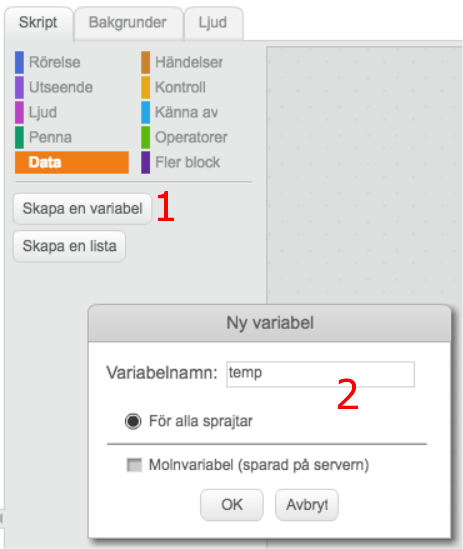
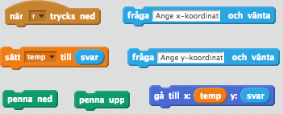

# Prick till prick

I denna uppgift ska du få skapa ett enkelt prick-till-prick spel. Du ska få lära dig att använda koordinater och penn-funktionen i Scratch. Det är en perfekt uppgift om du är kreativ.

Ett exempel på hur det kan se ut hittar du här:
<a href="https://scratch.mit.edu/projects/188770418/" target="_blank">https://scratch.mit.edu/projects/188770418/</a>

## 1: Remixa ett projekt

Vi börjar med att remixa ett existerande projekt. Detta gör att det blir enklare att komma igång. Dessutom får du två sprajtar och lite kod på köpet. Smart va?!

1. Öppna din webbläsare och gå till

    <a href="https://scratch.mit.edu/projects/172763429/" target="_blank">https://scratch.mit.edu/projects/172763429/</a>

2. Klicka på knappen **"Se inuti"** så att du kan se koden och Scratch studion.

    

3. Klicka sedan på knappen **"Remix"** så att du får din egen version av projektet.

    

    När du har remixat programmet så ser du att projektets namn har förändrats.

3. Döp om projektet till något som passar bättre.

    

I projektet har du nu en sprajt som visar koordinatsystemet scenen. Denna sprajt har en enkel kod som placerar axlarna på rätt ställe på spelplanen.

Du har också fått en bakgrund som består av 10 prickar, samt ett streck mellan punkt 1 och 10. Din uppgift är nu att koda så att du kan spela prick-till-prick.

## 2: En penna

Vi ska börja med att lägga till en penna i projektet.

1. Klicka på **"Välj sprajt från biblioteket"**

    

2. Markera **Pennan** och klicka på **Ok**

I början av spelet vill vi att den ska vara placerad vid prick nummer 1.

* Skapa ett skript för **Pennan** som säger:

    * När START klickas på

    * Gå till x: 50 y: 25

    

> Testa ditt program: klicka på den **Gröna flaggan**. Hamnar spetsen på vid prick nummer 1?

Det kommer den inte göra! Anledningen är att centrum för pennan är satt till ett helt annat ställe än spetsen. Detta kan vi ändra på.

1. Klicka på fliken **Klädslar**

2. Använd **förstoringsglaset** för att zooma in så att du ser pennspetsen lite tydligare

3. Klicka på **krysset i övre-högra hörnet** av ritytan. Nu visas centrum för pennan i ritytan.

4. Klicka på **pennspetsen** så att centrum för pennan hamnar där.   

    

    *Ungefär denna placering ska pennans centrum ha*

> Testa programmet igen! Flyttar sig pennan så att den nu pekar på prick nummer 1?

## 3: Rita

Vi ska börja med att fortsätta på *start-skriptet* som du skapade ovan och placerade pennan. Lägg därför till följande kod precis under **"Gå till..."**-blocket.

1. Radera

2. Sätt pennans färg till **"svart"**

3. Sätt pennans storlek till **3**

    Alla dessa kodblock hittar du under kategorin **Penna**.

    

1. Skapa en variabel som ska hålla svaret till en fråga vi ska ställa till den som ska spela.

    1. Gå till kategorin **Data** och klicka på **"Skapa en variabel"**

    2. Döp variabeln till **"temp"** (för temporär)

    

2. Skapa ett nytt skript som säger:

    1. När **"r"**-tangenten trycks ned

    2. Fråga **"Ange x-koordinat**" och vänta

    3. Sätt variabelen **temp** till "**svar"**

    4. Fråga **"Ange y-koordinat"** och vänta

    5. Penna ned

    6. Gå till **x: "temp" y: “svar”**

    7. Penna upp

    

> Testa ditt program! Klicka på den **gröna flaggan** för att starta spelet och sedan **r** för att rita. Får du ange x– och y–koordinater? Ritas ett streck ut på skärmen?

## Färdig!

Grattis, nu har du skapat ett nytt program!

Glöm inte att spara ditt projekt! Döp det gärna till uppgiftens namn så att du enkelt kan hitta den igen.

> **Testa ditt projekt**

> Visa gärna någon det som du har gjort och låt dem testa. Tryck på DELA för att andra ska kunna hitta spelet på Scratch. Gå ut till projektsidan och låt någon annan testa spelet!

## Utmaning

I stället för figuren som kom med projektet så kan du rita din egen. Klicka på **Rita ny bakgrund**. Använd sedan **penseln** och **textverktyget** för att skapa ett nytt mönster. Var kreativ! Glöm inte att ändra på **Pennans** startposition.

## Frågeställningar

Vad är en koordinat?

Hur lång är x–axeln i Scratch?

Hur lång är y–axeln i Scratch?

Vilken koordinat har mitten på scenen?

Vad innebär det att Remixa ett projekt?

Vad är ett startskript? Varför kan det vara bra att använda ett sådant skript?
