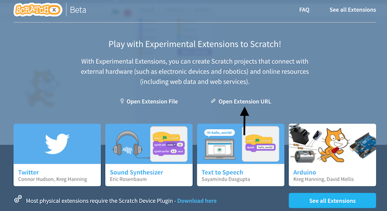
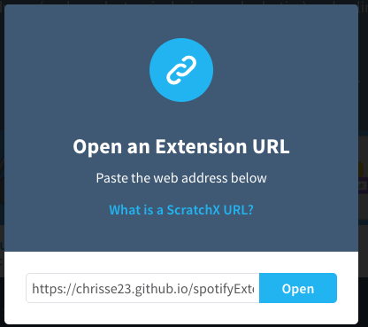
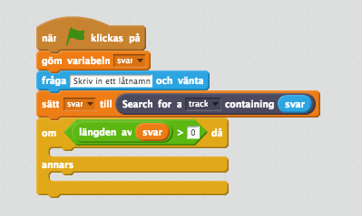
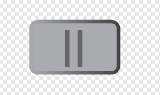
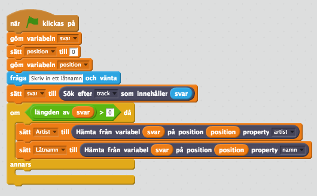
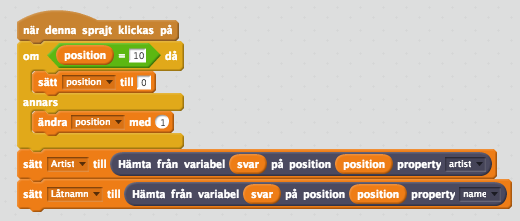
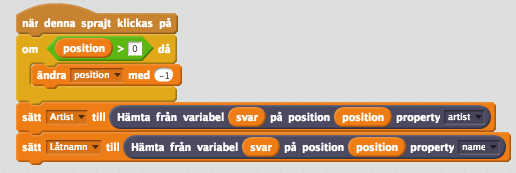
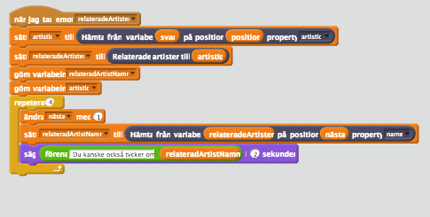

I detta projekt kommer du få skapa en musikspelare som spelar musik från Spotify. Du kommer kunna söka efter låtar och artister på Spotify och få tips på liknande artister.

För denna uppgift kommer du använda ScratchX som du kan använda för interagera med fysiska enheter och där vi kan använda våra egna block för att spela musik från Spotify. Du kommer inte kunna logga in på ditt Scratch-konto så du behöver spara ner ditt projekt till datorn. Efter det kan du ladda upp det igen och fortsätta arbeta. Använd nedanstående länk för att börja med uppgiften.

http://scratchx.org/?url=https://chrisse23.github.io/spotifyExtension/musicPlayer.sbx

Om du inte kommer in på sidan, prova med att trycka på "Open Extension URL".

Klistra in https://chrisse23.github.io/spotifyExtension/musicPlayer.sbx.

Klicka på open. Sedan klicka där det står "Klicka här för att aktivera Adobe Flash Player" och sedan tillåt i dialogen.

## 1: Titta på startblocken

1. I detta projekt får du redan några utplacerade startblock.

2. Det finns en skapad variabel som heter svar som göms när du klickar på start.

3. Sedan frågar vi användaren efter ett låtnamn.

4. När användaren har skrivit in ett låtnamn så söker vi efter låtar med det namnet på            Spotify och svaret läggs i variabel svar.

5. Efter det kollar vi om det finns något i variabel svar och finns det som visar vi svaret från Spotify vilket är låtar, låtnamn och artister. Senare kommer du att göra detta.

6. Nu ska du få skapa en variabel. Under data tryck på skapa en variabel och ge den namnet position och sedan sätt den till 0. Lägg den ovanför fråga blocket. Du kan också välja blocket göm variabel position på samma ställe.

Om du testar programmet nu så kommer du att se att du får skriva ett låtnamn och variabel svar kommer att fyllas med värden. Nu ska vi skapa upp musikspelaren och sedan visa vad som finns i variabel svar för användaren.

## 2: Skapa en bakgrund

1. För att ändra bakgrunden så tryck på SCEN längst till vänster och sedan på rita ny bakgrund eller välj bakgrund från biblioteket.

## 3: Skapa upp sprajtar för kontrollera musikspelaren

1. Tryck på knappen NY SPRAJT och leta upp sprajten button3.

2. Tryck sedan på KLÄDSLAR och måla knappen så den ser ut som på bilden nedanför.

    

3. Döp klädseln till spela-knapp.

4. Tryck på knappen NY KLÄDSEL och leta upp sprajten button3 och måla även den så den ser ut som på bilden nedanför.

    

5. Döp klädseln till pausa-knapp.

Som du ser så frågar vi efter en namnet på en låt men sedan händer inget mer. Det ska vi fixa nu!

## 4: Visa sökresultatet från Spotify

1. Klicka på bakgrundscenen och välj Skript.

2. Under kategorien **DATA** gör följande:

    1. **Skapa en ny variabel** som heter Artist.

    2. **Skapa en ny variabel** som heter Låtnamn.

    3. **Skapa en ny variabel** som heter Låt.

3. När du ska använda en variabel visas det med [ ] och namnet på variabel innanför.

4. Välj kategorien **FLER BLOCK.** Nu ska du i skriptet som säger om längden av svar är större än 0 så:

    4. **Sätt variabel [Artist] till** blocket **hämta från variabel [svar] på variabel [position] artist**.

    5. **Sätt variabel [Låtnamn] till** blocket **hämta från variabel [svar] på variabel [position] låtnamn**.

Nu visar vi på skärmen vilken artist och låt som kommer att spelas. Ditt block borde se ut såhär nu.

 

## 5: Spela och pausa musik

1. Klicka på sprajten som är din spela-knapp och välj blocket **när denna sprajt klickas på**.

2. Gör nu ett skript som gör följande:

    1. Om klädselnummer är lika med ett så:

        1. **Sätt variabel [Låt] till** blocket **hämta från variabel [svar] på variabel [position] låten**.

        2. Under kategorien **FLER BLOCK** välj blocket **Spela låt från url variabel [låt]**.

        3. **Byt klädsel till pausa-knapp**.

        4. **Skapa en ny variabel** som heter nästa och **sätt till 0**.

        5. Välj blocket **skicka meddelande** och sätt meddelandet till relateradeArtister.

        6. För alltid:

            1. Under kategorien **FLER BLOCK** välj blocket **Om låten har slutat spela** är lika med sant (men skriv true) så **byt klädsel till spela-knapp**,

    2. Annars så:

        7. Under katergorien **FLER BLOCK** välj blocket **Pausa låt**.

        8. **Byt klädsel till spela-knapp**.

Nu borde ditt skript se ut ungefär som på bilden nedan.

## 6: Nästa låt

Nu ska vi göra en ny sprajt för att kunna välja mellan låtar vi sökt på.

1. Tryck på knappen NY SPRAJT och leta upp sprajten button3.

2. Tryck sedan på KLÄDSLAR och måla knappen så den ser ut som på bilden.

    

3. Gå nu tillbaka till skript. Välj blocket **när denna sprajt klickas på** och gör ett skript som säger:

4. Om  variabel [position] är lika med tio så:

1. **Sätt variabel [position] till 0**.

      4.  Annars så

1. **Ändra variabel** [position] med 1.

      5. **Sätt variabel [Artist]** till blocket **hämta från variabel [svar] på variabel [position] artist**.

      6. **Sätt variabel [Låtnamn]** till blocket **hämta från variabel [svar] på variabel [position] låtnamn**.

Nu borde ditt skript se ut ungefär som på bilden nedan.

## 7: Tidigare låt

5. Tryck på knappen NY SPRAJT och leta upp sprajten button3.

6. Tryck sedan på KLÄDSLAR och måla knappen så den ser ut som på bilden.

    

7. Gå nu tillbaka till skript. Välj blocket **när denna sprajt klickas på** och gör ett skript som säger:

8. Om  variabel [position] är större än 0 så:

    1. **Ändra variabel** [position] med -1.

      5. **Sätt variabel [Artist]** till blocket **hämta från variabel [svar] på variabel [position] artist**.

      6. **Sätt variabel [Låtnamn]** till blocket **hämta från variabel [svar] på variabel [position] låtnamn**.

Nu borde ditt skript se ut ungefär som på bilden nedan.

Nu är din musikspelare nästan klar! Vi har en uppgift kvar och det är att för varje låt vi spelar ska vi visa fyra andra artister som liknar den vi spelar just nu. Så kan användaren få lite tips om vad personen kan spela härnäst.

## 8:  Relaterade artister

1. Tryck på knappen NY SPRAJT och leta upp sprajten wizard.

2. Välj blocket **när jag tar emot meddelande** och välj meddelandet relateradeArtister.

3. **Skapa en ny variabel** som heter artistId och sätt till blocket **hämta från variabel [svar] på variabel [position] artistId**.

4. **Skapa en ny variabel** som heter relateradArtister och sätt till blocket **relaterad artister från variabel [artistId]**.

5. **Dölj** båda variablerna ([artistId], [relateradArtister]).

6. Välj blocket **repetera x gånger** och skriv in att det ska repeteras 4 gånger. Inuti loopen gör du ett skript som säger:

    1. **Ändra variabel [nästa]** med 1.

    2. **Skapa en ny variabel** [relateradArtistNamn].

    3. **Sätt variabel [relateradArtistNamn]** till blocket **hämta från variabel [relateradArtister] på variabel [nästa] artist**.

    4. Välj blocket **förena** och skriv "Du kanske också tycker om " och **välj variabeln** [relateradArtistNamn] och sätt **förena** blocket i ett **säg** block i två sekunder.

Nu borde ditt skript se ut ungefär som på bilden nedan.

## Utmaning:

Nu när du har gjort klart din musikspelare kanske du vill utveckla den lite mer, nedan finns två förslag på extra funktioner att ha med i din musikspelare.

Under blocket **DATA** går det också att skapa en lista, skulle du kunna använda det för att låta användaren köa låtar som ska spela efteråt?

Om du tittar under kategorien **FLER BLOCK** så finns det tre block som du inte använt. Dessa heter **Starta från x sekunder**, **Fade in** och **Fade out**. Det första blocket kan du använda för att starta på en plats i låten du väljer mellan 0-30 sekunder. **Fade in** kan användas för tona in låten och **Fade out** för att tona ut låten. Kan du använda dessa tre block för att kunna göra dj-spelare?
