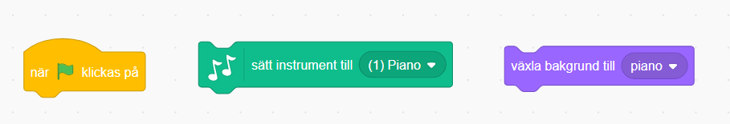
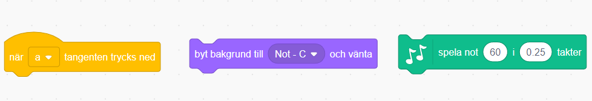
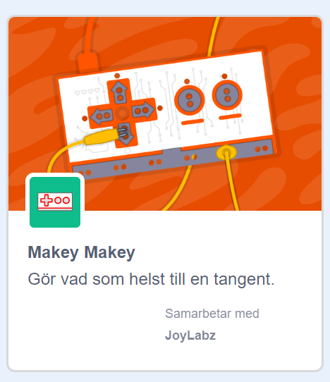
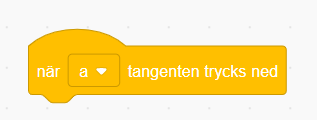
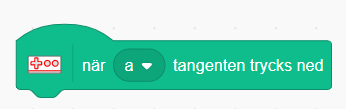
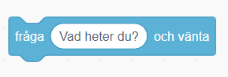

## Uppgift för Side by Side

I denna uppgift kommer du få skapa en spel som kommer att spela en melodi som du ska följa och spela samma som. Du kommer även att få lära dig lite grundläggande om noter.

Starta med att klicka på nedanstående länk
1. [https://scratch.mit.edu/projects/311971291/editor/](https://scratch.mit.edu/projects/311971291/editor/)

Du startar med en bakgrund av ett piano. Klicka på **Bakgrunder**. Där ser du att det finns flera 9 backgrunder.
Varje bakgrund representerar en vit tangent på pianot. Namnet på bakgrunden säger vilken ton du spelar på pianot i en C-skala.
C-skalan består av 8 noter och är: **C D E F G A B C**.

Längst till vänster ser du olika kategorier som heter "Rörelse", "Utseende", "Ljud" m.m. Under varje kategorie finns det olika block du kan programmera med. Vi kommer i denna uppgift främst att använda block från "Utseende", "Händelse" och "Musik".

---

## 1 - Välja instrument

Det första vi ska göra är att sätta bakgrund och välja instrument. Nu kommer vi att välja piano men sedan kan du testa att byta till ett annat instrument.

Dessa block behöver vi ha:



Kan du koppla ihop dessa? I nästa steg ska vi koppla ihop block så att du kan spela en not på pianot.

---

## 2 - Spela en not

Nu ska vi göra så att vi kan spela på pianot med tangentbordet.

Dessa block behöver vi ha:



1. På blocket ``` När mellanslag tangenten trycks ned ``` välj bokstaven **a**.

Nu ska vi sätta bakgrund som ska visa vilken ton vi spelar.

2. På blocket ``` Byt bakgrund till ``` och välj **Not-C**.Detta betyder att vi kommer att spela noten C på pianot.

3. På blocket ``` Spela not 60 i 0.25 takter ``` så klicka på siffran 60. Då kommer du få upp ett litet piano välj not C(60).

Testa ditt program nu och tryck på bokstaven **a** på tangentbordet, ser du att du spelar noten C?

Kan du nu göra samma som ovan fast denna gång väljer du att när bokstaven **s** trycks ner ska du spela noten **D**.

Fortsätt sedan med bokstäverna **d, f, g, h, j, k** som ska spela noterna **E F G A B C**.

Kan du spela hela C-skalan nu?

---

## 3 - Hemligt meddelande

Klicka på kategorien "Händelser" och dra ut blocket ``` Skicka din tur ``` och koppla ihop det med ``` Sätt instrument till piano ```. Ändra sedan meddelandet till **hemligt meddelande**. Tryck sedan på den gröna flaggan och se vad som händer!

Dra nu ut samma block som innan och sätt det under ovanstående block och tryck på den gröna flaggan. Kan du spela samma melodi som precis spelades?

---

## 4 - Extra utmaning

Om du vill ha en extra utmaning kan du testa och göra ditt eget piano med Makey Makey.

Klicka på ikonen som du ser i bilden nedan


Välj tillägget Makey Makey.



Nu har du fått två nya block att programmera med! Kan du byta ut dessa block:



Mot dessa block:



Koppla sedan in din Makey Makey i en USB-ingång och testa att spela igen!

---

## 5 - En till utmaning

Skulle du kunna med blocket som är i bilden nedan fråga efter varje not du spelar och spelaren skriva in notens namn?


 
---

## 6 Färdig!

Gratulerar nu har du gjort ett piano som kan spela en C-skala.

