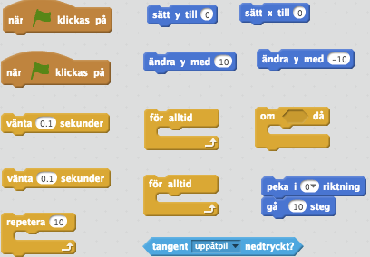

# Draken mot hajarna

I den här uppgiften skall du få koda en drake som kan flyga runt. Du kommer styra den med piltangenterna. Det kommer också att finnas hajar som hoppar och försöker äta upp draken. I den här uppgiften kommer du att jobba med funktioner (egna block) och du kommer lära dig vad som är bra med dem.

Ett exempel på hur  spelet kan se ut ser du här:

* <a href="https://scratch.mit.edu/projects/116717825/" target="_blank">Exempel</a>

## Delmoment 1: Sätta upp bakgrunden och draken

1.	Skapa ett nytt projekt och ta bort katten

2.	Lägg till en valfri **bakgrund** som du tycker är rolig. Jag valde **city with water 2**

3.	Lägg till sprajten **Dragon** från biblioteket och **byt namn** på den till **Drake**. Placera den i mitten av scenen.

4.	Skapa ett skript för **Drake** som säger:

  * Startar när START klickas på

  * Går till **X-värdet: 0** och **Y-värdet: 0**

  * För alltid:

    * **Repetera 10 gånger**: Ändra **y** med **10** och **vänta** 0.1 sekunder

    * **Repetera 10 gånger**: Ändra **y** med **-10** och **vänta** 0.1

5.	Skapa ett nytt skript för **Drake** som säger:

  * Startar när START klickas på

  * För alltid:

   * **Peka uppåt** och **gå 10** steg OM **”uppåtpil”** är neddtryckt

   * **Peka nedåt** och **gå 10** steg OM **”nedåtpil”** är neddtryckt

   * **Peka höger** och **gå 10** steg OM **”högerpil”** är neddtryckt

   * **Peka vänster** och **gå 10** steg OM **”vänsterpil”** är neddtryckt

   

   _Här är några av de block du behöver för punkt 4 och 5. Tänk på att vissa block kan du behöva använda mer än 1 gång._

Klicka på START knappen. Åker draken upp och ner precis som om den svävar? Kan du styra den med piltangenterna?

Om du vill att drakens klädsel bara ska vända sig åt höger och vänster även om draken åker uppåt och neråt så kan du sätta **rotationsstil** till **vänster-höger**.

_Den röda rektangeln visar de olika rotationsstilarna. Den blåmarkerade är **vänster-höger**._

## Delmoment 2: Hajar!

Nu skall du få skapa hajar som skall försöka äta upp draken. Flera hajar skapar vi med hjälp av kloner.

1.	Lägg till sprajten **Shark** och ge den namnet **Haj**

2.	Skapa ett skript för **Haj** som säger:

  * Startar när START klickas på

  * **Göm** hajen

  * För allitd:

    * **Vänta** 1 sekund

    * Gå till **x:0** och **y:-100**

    * **Skapa klon** av mig själv

3.	Skapa ett nytt skript för **Haj** som säger:

  * Startar när den **startar som klon**

  * **Peka** mot **Drake**

  * **Visa** sprajten

  * **Gå 10** steg **tills** den **far upp i taket** (y > 180)

  * **Peka** nedåt

  * **Gå 10** steg **tills** den **far i marken** (y < -180)

  * **Radera** klonen

4.	Skapa ett skript för **Drake** som säger:

  * Starta när START klickas på

  * För alltid:

    * **Göm** om rör hajen

5.	Lägg till ljudet **chomp** och **spela** det när hajen rör draken

6.	Lägg till ett **visa**-block på lämpligt ställe så draken syns när **spelet start**.

  

  _Här de block du behöver för delmoment 2. Tänk på att vissa skall användas för **Drake** och andra för **Haj**._

Testa spelet! Försvinner draken när hajen äter upp den?

## Delmoment 3: Spelet slutar och börjar om
Nu skall du få skapa en ny bakgrund som skall visas när spelet tar slut. Du skall också få koda så att det räcker med att trycka på mellanslag för att börja om spelet.

_Den röda rutan visar var du kan ändra namn på en bakgrund._

1.	**Rita en ny bakgrund!** Den skall visas när spelet tar slut så jag använde pensel för att skriva **”Spelet slut!”**.

2.	Ge bakgrunden namnet **”spelet slut”**

3. Ändra i **drakens skript** så att den skickar meddelandet **”spelet slut”** när den **rör hajen**. Lägg också still **stoppa andra skript** i sprajten.

4.	Skapa ett skript för **scenen** som säger:

  * Startar när meddelandet **”spelet slut”** tas emot

  * Byt bakgrund till **”spelet slut”**

  * **Vänta tills** tangenten **”mellanslag”** är nedtryckt

  * Byt bakgrund till **”city with water”** (eller den bakgrund du använde dig av)

  * Skicka meddelandet **”nytt spel”**

5.	Skapa ett nytt skript för scenen som ser till att bakgrunden är **”city with water”** när **spelet startar**.

6.	Skapa ett skript i **Haj** som säger:

  * Startar när sprajten tar emot meddelandet **”spelet slut”**

  * **Stoppa andra skript** i sprajten

  * **Radera** klon

  

  _Här de block du behöver för punkterna 4 till 6 ovan. Tänk på att vissa skall användas för **Haj** och andra för **scenen**._

7.	Skapa ett nytt skript för **Haj** som säger:

  * Startar när den tar emot meddelandet **”nytt spel”**

  * Kör samma skript som när START klickas på. Du kan **högerklicka** på blocken och välj **kopiera!**

  

  _Denna meny kommer upp om du högerklickar på ett block._

8.	Skapa nya skript för **draken**. **Alla skript** som körs när START klickas på skall också köras när den tar emot meddelandet **”nytt spel”**. Du kan **högerklicka** på blocken och välj **kopiera!**

Testa! Kan du starta om spelet genom att klicka på mellanslag?

_Ungefär så här mycket kod skall du ha skapat för **Drake** nu._

## Delmoment 4: Funktioner
Du kanske tidigare stött på funktioner i matematik eller på andra ställen. När du kodar funktioner så fungerar dom på ett lite annorlunda sätt. Du kan använda funktioner du koder till att spara tid och göras så att din kod är lättare att förstå. I förra delmomentet kopierade du massor av block som gör precis som sak. Det är onödigt och kan skapa en massa problem. I stället skall du få koda funktioner som sedan kan återanvändas.

Vi börjar med hajen:

1.	Klicka på **hajen** så att den är markerad och du kan skapa koda för den sprajten

2.	Klicka på **Flera block** och sen på **Skapa ett block** för att skapa en funktion. Namnge block till **”för alltid(klona mig)”**.

_Hur det kan se ut på skärmen när du klickat på **Skapa ett block**_

3.	Nu skall det ha dykt upp ett **stort lila block** i hajen som används för att berätta **vad funktionen gör**.  Flytta koden som startar när START klickas på så dessa block är under **definitionen** av **”för alltid(klona mig)”**.

4.	Lägg till ett **block** för **”för alltid(klona mig)”** under blocket med den gröna flaggan. Nu kommer denna funktion köras när du klickar på START

5.	Ta bort koden som körs när sprajten tar emot meddelande **”nytt spel”** och lägg till ett block för **”för alltid(klona mig)”**.

_Ungefär så här kan koden för **Haj** set ut nu. Fiffigt va!_

Testa spelet! Fungerar det precis som förut? Tycker du det är enklare att förstå koden nu?

Nu till draken:
1.	Skapa ett **nytt block** för varje funktion som du vill göra. **Namnge blocket** till något som gör det lätt att förstå vad **funktionen gör**.

2.	Du kan till exempel skapa ett nytt block som heter **”sväva”** och under **definitionen** för detta block lägga in koden som gör att **draken svävar**.

3.	Ersätt koden som körs när START klickas på och när meddelandet **”nytt spel”** tas emot med ett block för **”sväva”** (eller vad du nu kallade blocket).

4.	**Repetera** punkterna 1 till 3 för all kod som du vill göra till funktioner.

  

  _Ungefär så här kan koden för **Drake** se ut nu. Jämför med hur det var innan!_

## Färdig!
Grattis, nu har du gjort klart uppgiften.

**Glöm inte att spara ditt projekt!** Döp det gärna till uppgiftens namn så att du enkelt kan hitta den igen.

**Testa ditt projekt**  
  Visa gärna någon det som du har gjort och låt dem testa. Tryck på DELA för att andra ska kunna hitta spelet på Scratch. Gå ut till projektsidan och låt någon annan testa spelet!

## Utmaningar

**Hajens utseende**. Om du klickar på hajen och kollar på sprajtens klädslar, så ser du att den har flera stycken. Kan du skapa ett skript i hajen så att den har en öppen mun när den hoppar mot draken och stänger munnen när den rör vid draken?

**Ofarlig haj**. När hajen har nått taken är den egentligen ofarlig eftersom den har misslyckats med att äta upp draken. Men för tillfället kan den äta upp draken även på vägen ner från ”taket”. Kan du fixa så att den inget händer med draken om den stöter på en haj på vägen ner? Tips: Använd en **lokal variabel** för att hålla koll på om hajen har slagit i taket.

**Ökad svårighet**. Kan du göra så att spelet blir svårare efter ett tag? Det finns flera olika varianter på detta.

## Frågeställningar

* Hur kan du kopiera kod i Scratch?
* Vad är en funktion? Varför är det bättre att använda en funktion än kopiera kod?
