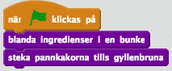
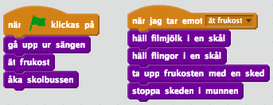

## Algoritm

*En algoritm är en instruktion som löser ett problem eller uppgift.*

Varje datorprogram består av många algoritmer och varje algoritm består av flera rader kod. En dator genomför koden i en algoritm rad efter rad, precis som när du läser en bok. Därför är det viktigt att algoritmen är

* Exakt
* Fullständig
* I rätt ordning

I kodstugan kommer ni få programmera olika program och skapa olika algoritmer. Därför kan det vara bra att tänka på punkterna ovan.

**Vardagsexempel**

Det är vanligt att likna en algoritm med ett recept. Ett recept består av en lista av ingredienser och instruktioner för att få till en maträtt av ingredienserna. Tänk dig att du har ett recept på att laga pannkakor: du ska blanda ägg, mjölk och mjöl och sedan steka smeten i en panna till dess att pannkakorna är gyllenbruna. Här är det viktigt att receptet är *exakt* så att du vet till exempel hur mycket av ingredienserna du ska blanda i smeten. Det är också viktigt att receptet är *fullständigt* så att du vet till exempel när du ska sluta steka pannkakorna. Till sist är det viktigt att instruktionerna är *i rätt ordning* så att du till exempel inte försöker vispa i äggen efter att du har stekt pannkakorna.

Ett annat exempel på en algoritm är instruktioner till dig själv vad du ska göra på morgonen och hur du tar till dig skolan. Det kanske börjar med att du ska klä på dig, och sen att du ska äta frukost, och till sist att du ska sätta sig på rätt buss. Varje av dessa steg kan du sedan se som en algoritm i sig, till exempel en algoritm för att äta frukost kan bestå i att 1) hälla filmjölk i en skål, 2) hälla flingor över filmjölken, 3) ta upp frukosten med en sked och 4) stoppa skeden i munnen.

