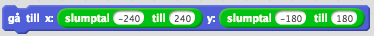

## Slumptal

*Ett slumptal är ett tal som inte kommer vara samma varje gång du kör programmet*

Ett slumptal används för att styra ett program på ett slumpmässigt sätt, det vill säga att programmet inte ska bete sig på samma sätt varje gång vi kör det. Det finns många användning för ett slumptal i ett program. De kan användas för att

* Placera ut spelare på en spelplan

* Ta fram ett tillstånd till exempel i ett kortspel

* Göra datorn mer lik en människa eftersom människor ofta beter sig slumpmässigt

**Vardagsexempel**

Du har en algoritm som går ut på att steka pannkakor. Här tänker du kanske att det inte finns så mycket slumpmässigt utan det är ju samma recept som du följer varje gång. Men det är faktiskt så att många av stegen i algoritmen har ett visst slumpmässigt beteende över sig. Ett exempel är mätningen av mjöl: oftast står det angivet i deciliter, till exempel "häll i 5 dl mjöl i smeten". Men beroende på hur tätpackat mjölet är och hur noggrann du är när du mäter upp med decilitermåtter får du olika mycket mjöl. Det vill säga vikten mjöl är ett slumptal. Ett annat slumptal är storleken och tjockleken på pannkakorna: om du inte är extremt noggrann och mäter upp smeten innan du häller den i pannan och du har en väldigt jämn panna så kommer storleken skilja sig åt mellan pannkakorna.

Du äter frukost som består av fil och flingor. Då är en del av algoritmen att du häller fil i en skål och sedan häller flingor ovanpå filen. Och inte tar du fram ett decilitermått och mäter upp hur mycket fil du häller i skålen, eller hur? Nej du måttar med ögat och då kommer mängden fil vara ett slumptal. På samma sätt kommer du inte räkna exakt hur många flingor du häller på filen och då kommer antalet flingor vara ett slumptal.
