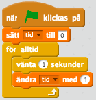
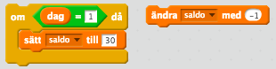

## Variabel

*En variabel är ett minnesfack i ett program som används för att spara värden*

En variabel kan liknas vid en låda där du kan spara värden. Varje variabel har också ett *namn* som gör det lätt att identifiera den. I ett program används en variabel för att hålla reda på tillstånd av olika saker, till exempel

* Namnet på en spelare

* Hur fort en bil kan åka

* Tiden det har tagit sedan spelet startade

**Vardagsexempel**

I en algoritm som går ut på att steka pannkakor hittar vi mängder av variabler. Det är till exempel hur mycket av varje ingrediens du har tillsatt i smeten, temperaturen på plattan och tiden du har stekt pannkakan. Dessa variabler kan du använda för att kolla så att smeten har rätt innehåll om du jämför med receptet. Med hjälp av temperaturen på plattan kan du avgöra om det är dags att hälla smeten i pannan och tiden kan du använda för att avgöra om det är dags att vända på pannkakan.

I en algoritm som går ut på att åka buss till skolan finns det massor av olika variabler – från hastigheten på bussen till antalet passagerare. En annan variabel är saldot på ditt busskort. Du kanske har ett månadskort som behöver fyllas på i början av varje månad. Då är variabeln *saldo* antalet dagar som har gått sedan du fyllde på det. I mitten av månaden är då *saldo* ungefär 15, och i början av månaden är *saldo* 30. Varje dag kommer *saldo* minska med ett.

