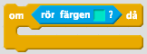
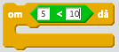
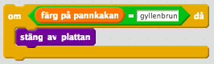
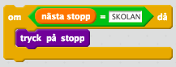

## Villkor

*Ett villkor är ett sätt att utföra instruktioner vid ett specifikt tillstånd*

Ett villkor används i algoritmer för att styra flödet av instruktioner. I stället för att utföra varje instruktion rad för rad kan vissa instruktioner bara utföras när något är sant.

Detta något kan vara till exempel

* Att känna av en färg

* Att ett tal är mindre eller större än ett annat tal

* Att en bokstav är nedtryckt på tangentbordet.

Vi använder oss av en OM-sats och utför endast instruktioner *om* något är sant.

**Vardagsexempel**

Du har en algoritm som går ut på att steka pannkakor och du vill ju ha gyllenbruna pannkakor. Därför vill du avsluta stekningen innan de blir svarta och oätbara. Då kan du använda dig av villkor och en OM–sats: *om* pannkakan är gyllenbrun *då* stänger jag av plattan och lägger upp pannkakan på tallriken.

Tänk dig att sitter på bussen och är på väg till skolan. Då behöver du trycka på Stanna-knappen men bara när nästa stopp är skolan. Då kan du använd dig av villkor och en OM-sats: *om* nästa stopp är skolan *då* tryck på Stanna-knappen.

