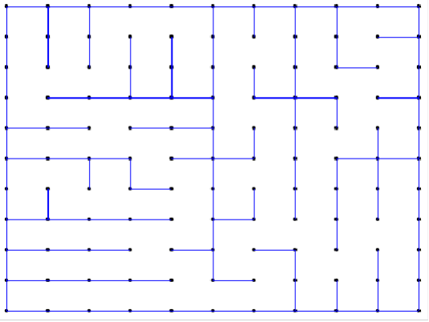
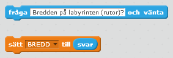
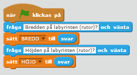
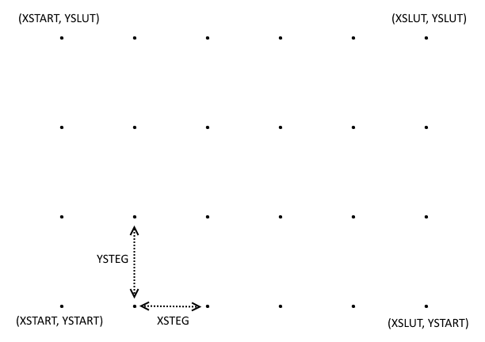
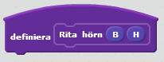
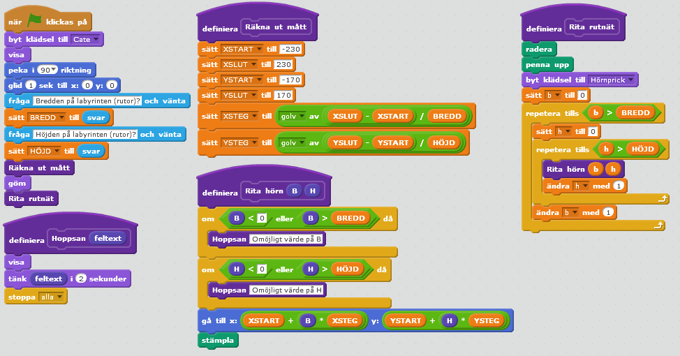

# Labyrintgenerator
Vårt uppdrag är att skriva en labyrintgenerator i Scratch. Man ska kunna välja bredd och höjd på labyrinten, som ska vara rektangulär.

Det ska gå att ta sig mellan labyrintens fyra hörn. Labyrinten ska se olika ut från gång till gång.

En labyrintgenerator kan man ha nytta av i olika spel. Därför är det bra om vi har några få sprajtar som man kan importera med ryggsäcken.

Så här kan det se ut när vi är klara:

Låter det krångligt? Vi tar ett steg i taget. Jag har formulerat en önskelista som kanske kan hjälpa.

## Önskan 1. Det går att välja bredd och höjd på labyrinten

Den här önskan kan vi uppfylla genom att katten frågar om bredd och höjd. Vi sparar svaren i variablerna `BREDD` och `HÖJD`.

Pröva nu att göra en lösning på egen hand innan du går vidare.

### Ledtrådar

Här är några block som kan vara bra att ha:

### Lösningsförslag

Än så länge är det bara katten som frågar. Ingen labyrint syns än.

### Förbättringsidéer

1. Behöver vi kontrollera indata bättre? Vad är rimliga värden på variablerna `BREDD` och `HÖJD`?

## Önskan 2. Det syns ett rutnät
Vi vill att det ske ut något i den här stilen om vi svarat `BREDD` 5 och `HÖJD` 3.

Om vi pekar med muspekaren på scenen så ser vi att Scratch har ett koordinatsystem där `X` går från &ndash;240 till 240 och `Y` går från &ndash;180 till 180. Våra yttersta prickar behöver ligga en liten bit in från kanten så att de syns. Jag har därför använt variablerna
`XSTART`,
`YSTART`,
`XSLUT` och
`YSLUT` som du kan se i bilden. Jag satte t.ex. `XSTART` till &ndash;230 för att hålla mig en bit från vänsterkanten. Genom att använda variabler och inte skriva t.ex. &ndash;230 direkt i koden kan jag justera storleken enkelt om det behövas.

 
Med 5&times;3 rutor (bredd&times;höjd) behövs det ju sex hörnprickar på bredden och fyra på höjden. Avståndet mellan ytterhörnen på bredden är `XSLUT`&ndash;`XSTART` pixlar och genom att dividera med `BREDD` får vi antalet pixlar mellan hörnprickarna. Vi kallar det avståndet `XSTEG`. Se bilden, där `YSTEG` också visas.

### Ledtrådar
* Det kan vara bra att dela upp koden i flera block. Tänk på att du kan skapa egna block. Ett användbart block kan vara

där B är bredden och H höjden. Det nedre vänstra hörnet kan t.ex. vara (B, H) = (0, 0) och övre högra hörnet (B, H) = (`BREDD`, `HÖJD`).

* Ändra gärna koden som du skrev i steg 1. Det är viktigt att skriva om kod som inte passar längre.

* Hörnprickarna kanske kan vara en ny klädsel hos katten? Då slipper vi skapa en ny sprajt.

* Några block som kan vara bra att ha:

### Lösningsförslag

### Förbättringsidéer

## Önskan 3. Det syns en yttervägg
### Ledtrådar
### Lösningsförslag
### Förbättringsidéer

## Önskan 4. Det finns minst en väg genom labyrinten för varje par av hörn

## Önskan 5. Väggarna delar sig på olika ställen, inte alltid i mitten som i nr 4

## Önskan 6. Väggarna delar sig antingen horisontellt eller vertikalt, inte bara horisontellt som i nr 5
