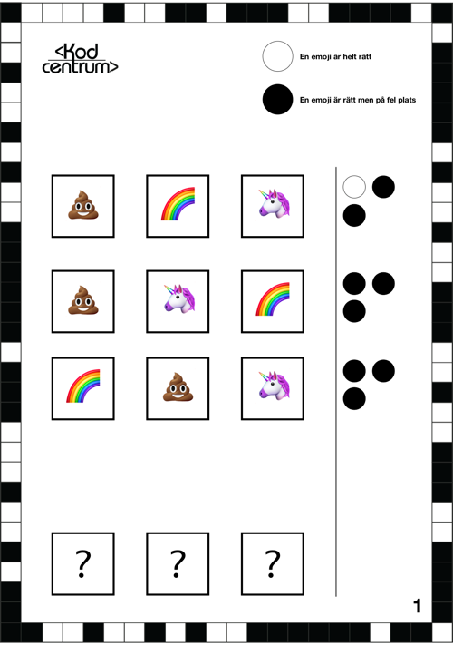

# Emojikoden

**Kan du knäcka koden och räkna ut vilka emojis som ska stå i vilken ordning?**

Denna lek är inspirerad av spelet Mastermind och går ut på att deltagarna ska försöka knäcka en kod genom uteslutningsmetoden. De får ett papper med ett par felaktiga kodrader med emojis. Med hjälp av dessa ska de försöka lista ut rätt kodrad. 

Vita och svarta cirklar ger ledtrådar för hur många emojis som är rätt och om de ligger i rätt ordning. Det gäller alltså att lista ut vilka emojis som ska vara med i kodraden och i vilken ordning de ska stå!

## Material att ladda ned och skriva ut

* [Ladda ned Emojikoden (inkl facit) som PDF](https://github.com/Kodcentrum/Scratch-uppgifter/blob/master/lek_kodkn%C3%A4ckaren/Emojikoden.pdf target="_blank")

## Instruktioner för handledare

**Tidsåtgång: Ca 10-20 min**

Dela in deltagarna i mindre grupper eller låt dem jobba parvis. 

1. Dela ut den utskrivna pdf:en med Emojikoden - tre uppgifter. Göm undan den sista sidan som är facit. 
3. Ge deltagarna ett problem i taget att lösa. Förklara uppgiften och vad de vita och svarta cirklarna betyder. 
4. När deltagarna tror att de kommit fram till rätt kod – ge dem inte svaret direkt. Gå igenom koden och "testa" den mot de olika svarsalternativen för att se om deras kod fungerar, så att ni tillsammans kommer fram till om det är rätt kod eller om ni behöver hitta en annan lösning tillsammans. 
