# Sten, sax och påse

I denna uppgift ska du få koda ett Sten, sax och påse spel för två spelare. Du kommer få lära dig variabler, slumptal och hur två micro:bits kan kommunicera med varandra.

Ett exempel på spelet hittar du här: <a href="https://makecode.microbit.org/_dzK16s3k6Vq1" target="_blank">https://makecode.microbit.org/_dzK16s3k6Vq1</a>

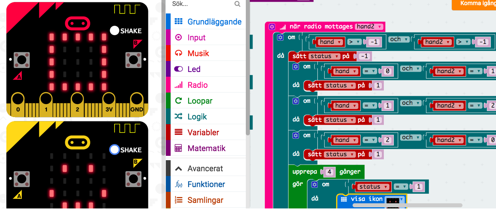

Om du aldrig har kodat en micro:bit förut är det bra om du gör uppgiften **Uppvärmning** först. Då får du lära dig lite enklare saker om micro:biten.

## 1 – För en spelare

Nu ska du få börja koda en enkel variant där du skakar fram en sten, sax eller en påse som visas på micro:bit displayen.

> När du startar micro:bit studion så finns det två block redan där. Ett block som startar kod när du starta micro:biten och ett block som hela tiden kör en loop i bakgrunden.

Sten, sax och påse spelet ska däremot starta när du skakar på micro:biten.

1. Dra ett block **"när skaka"** från kategorin **Input** till kodytan

    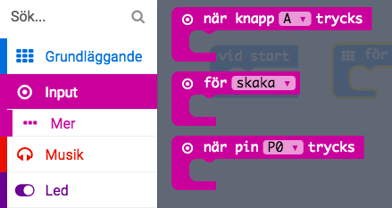

    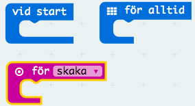

2. Dra in ett block **"sätt _namnlös_ till 0**" från kategorin **Variabler** och lägg det innanför när skaka”-blocket

3. Klicka på nedåtpilen bredvid **_namnlös_** och sedan på **Ändra namn på variablen...**

    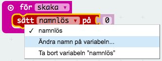

4. Döp variabeln till **"hand"**

    > En variabel är ett minnesfack som kan hålla olika värden. Variabeln **"hand"** kommer hålla reda på om din "hand" är en sten, sax eller påse.

5. Istället för **0** ska du sätta **"hand"** till ett slumptal mellan 0 och 2. Variabeln kan alltså få värdena 0 (_sten_), 1 (_sax_) eller 2 (_påse_).

	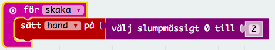

Nu ska du få visa en sten, sax eller påse på displayen beroende på värdet på variabeln **"hand"**. För att göra det enkelt och snyggt ska du få koda en funktion.

1. Klicka på kategorin **Avancerat** och sedan **Funktioner**

2. Klicka på **Skapa en funktion** och döp den till **"VisaHand"**

    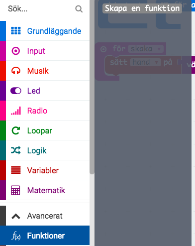

3. Nu ska du se definitionen av funktionen på kodytan.

    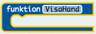

4. Innanför detta block lägg följande kod

    1. OM **"hand"** är lika med 0

        1. Visa ikon **"Diamant"** (detta block hittar du under kategorin **Grundläggande**)

        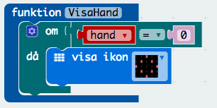

        "Diamant" är den ikonen som är mest lik en sten. När **"hand"** är 0 så betyder det ju att din hand är en sten.

5. Fortsätt sedan på koden för **"VisaHand"** och lägg in två OM-satser till

    2. Visa en sax OM **"hand"** är 1

    3. Visa en påse OM **"hand"** är 2

    > Du får själv välja ikoner eller så kan du välja blocket **"visa lysdioder"** och rita din egen ikon!

6. Lägg in ett block **"anropa funktionen VisaHand"** precis efter du har slumpat fram värdet på **“hand”**

    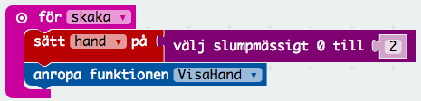

> **Testa!** Du kan testa ditt spel med hjälp av simulator till vänster i fönstret. Klicka på den lilla cirkeln bredvid **SHAKE**.

> **Ladda ner spelet!** Döp spelet till **sten** och klicka på **"Ladda ner"** för sedan över filen med programmet till micro:biten med en USB-kabel. Vad händer om du skakar på den?

## 2 – För två spelare – initiering

Nu ska koda så att två micro:bits kan kommunicera med varandra genom radiosignaler. På det sättet blir det roligare att spela.

Här behöver du kommunicera med minst en annan person som kodar samma uppgift, så att just era micro:bits är de som kommunicerar!

1. Lägg in följande kod under blocket **"vid start"**

    1. Sätt **"hand"** till -1

    2. Radio **ställ in grupp** 1. Detta block hittar du under kategorin **Radio**.

    > **Välj ditt eget gruppnummer**! Det gör att bara du och din kompis kan kommunicera.

    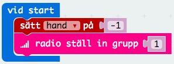

2. Under blocket **"för alltid"** lägg in ett block **radio sänd nummer “hand”**.

    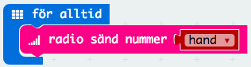

Nu är du klar med initieringen av spelet, men fortfarande händer inte så mycket mer. Det ska du få ändra på nu.

## 3 – För två spelare – vem vann?

Nu kommer du hela tiden sända värdet på variabeln **"hand"** till den andra micro:biten i din grupp. Samtidigt kommer den andra micro:biten i din grupp också sända ut värdet på sin variabel **“hand”**. När du tar emot det värdet kan du kolla om du vann eller förlorade. Det ska du få koda nu!

1. Från kategorin **Radio** dra in ett block **"när radio mottages..."** till kodytan

    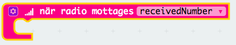

2. Istället för att kalla variabeln som du tar emot **"receivedNumber"** så ska du kalla den **“hand2”**

3. Klicka på den texten *"receivedNumber"* så kommer det upp en ruta där du kan skriva in det nya namnet.

4. Döp variabeln till **"hand2"**

I detta block ska vi kolla vem som har vunnit men vi vill bara göra det när både **"hand"** och **“hand2”** har fått ett slumptal mellan 0 och 2, det vill säga när både du och din motspelare har skakat på micro:bitsen.

1. Lägg därför en OM-sats innan för blocket **"när radio mottages..."** som kollar villkoret att både **“hand”** och **“hand2”** är större än –1. Du hittar de flesta block under kategorin **Logik**.

    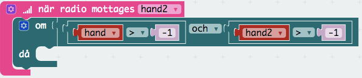

2.  Innanför detta kodblock lägg följande block **sätt "status" på -1.**

    > **"Status"** är en variabel som har koll på om du vinner eller förlorar. Om **“status”** har värdet -1 blev det oavgjort eller så förlorade du. Nu ska du koda så att du ändrar “**status”** till 1 vilket betyder vinst om du har en bättre hand än din kompis.

1. Skapa följande kod efter du satt **"status"** till -1

    1. Sätt  **"status"** till 1 OM **“hand”** är 0 (sten) OCH **“hand2”** är 1 (sax)

    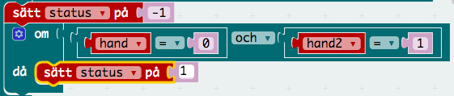

    2. Sätt  **"status"** till 1 OM **“hand”** är 1 (sax) OCH **“hand2”** är 2 (påse)

    3. Sätt  **"status"** till 1 OM **“hand”** är 2 (påse) OCH **“hand2”** är 0 (sten)

2. För att visa vem som har vunnit skapa följande kod direkt efter du har satt värdet på **"status"**

    4. Upprepa 4 gånger

        1. OM **"status"** är 1: Visa ikon **"Glad"**

        2. ANNARS: Visa ikon **"Ledsen"**

        3. Anropa funktionen **"VisaHand"**

3. Lägg in ett block som sätter **"Hand"** till **–1** sist

    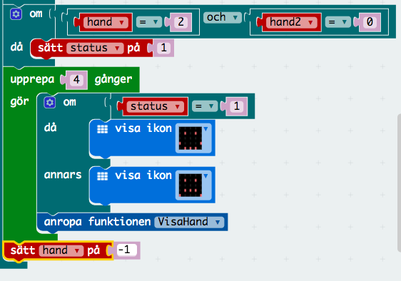

 > **Testa!** Du kan testa ditt spel med hjälp av simulator till vänster i fönstret. Klicka på den lilla cirkeln bredvid **SHAKE** och gör sedan samma sak på den andra micro:biten som dyker upp.

> **Ladda ner spelet!** Döp spelet till **sten2** och klicka på **"Ladda ner"** för sedan över filen med programmet till micro:biten med en USB-kabel. Vad händer om du och din kompis skakar på era micro:bits?

## Färdig!

Grattis, nu har du skapat ett nytt spel!

Glöm inte att spara ditt projekt! Döp det gärna till uppgiftens namn så att du enkelt kan hitta den igen.

> **Testa ditt projekt**

> Visa gärna någon det som du har gjort och låt dem testa. Tryck på DELA och dela koden med en kompis.

## Utmaningar

### Animation

Skapa en animation i stället för att visa en glad eller ledsen ikon när du tar emot radiosignalen från din kompis.

* Du kan använda block i kategorierna **Grundläggande** och **Loopar**

* Eller så kan du använda mer avancerade block som du hittar om du klickar på **Avancerat** och sedan **Bilder**

#### Javascript

Utforska det textbaserade språket *Javascript*! Precis all kod du kan skriva med hjälp av block kan du också skriva med ett textbaserad programmeringsspråk.

* Klicka på knappen **JavaScript**

    

* Nu visas all kod som du skrivit i Javascript i stället. Gå igenom rad för rad och försök förstå vad koden gör.

    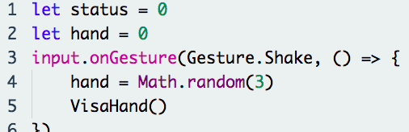

* Skriv **en** kodrad som gör att texten "Sten, sax och påse" visas på micro:biten när du startar den.

    Använd functionen **basic.showString()** och lägg in texten du vill visa mellan parenteserna.

## Frågeställningar

* Vad är en variabel?

* Vad kan du använda ett slumptal till?

* Vad kan du använda funktioner till?
