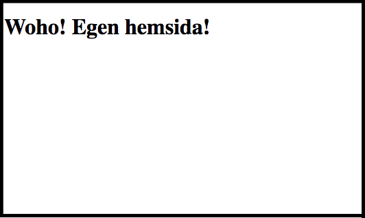
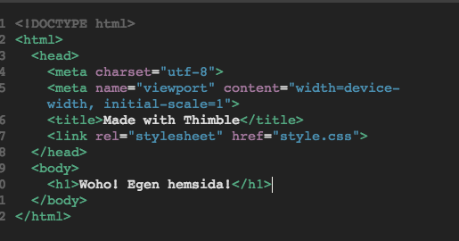

**I denna uppgift kommer du få göra en egen hemsida med Mozilla Thimble som är ett verktyg att göra just hemsidor i.  Du kommer sedan kunna publicera denna sida och visa för familj och vänner!**

Ett exempel på en sida kan du hitta [här](https://thimbleprojects.org/christoffer/408964/ "Exempeluppgift").

En hemsida är uppbyggd av tre byggstenar HTML, CSS och Javascript. HTML är sidans struktur och som byggblock använder man HTML-taggar. Exempel på en HTML-tagg kan vara ```<h1>``` för att skapa en rubrik eller `````` för att lägga in en bild. CSS används för att bestämma hur sidan ska se ut gällande färg och form. Exempelvis om en knapp ska vara grön eller röd, vilken bakgrundsfärg sidan ska ha. Javascript används för interaktion på hemsidan, till exempel vad som ska hända när man trycker på en viss knapp. I denna uppgift kommer vi främst att fokusera på HTML när vi ska bygga vår hemsida.

På nedanstående bild visas hur en grundläggande HTML-sida ser ut. Sidan startar och slutar alltid med en ```<html>``` - tagg. Det som syns på sidan är de HTML-taggar som finns inom ```<body>```.







## 1: Använda HTML-taggar

De finns väldigt många HTML-taggar men i denna uppgift är det tänkt att ni kan använda följande:


- `````` - För att visa en bild
- ```<h1></h1>``` - Stor rubrik
- ```<h2></h2>``` - Mellan rubrik
- ```<h3></h3>``` - Liten rubrik
- ```<p></p>``` - Vanlig text
- ```<i></i>``` - Kursiv text
- ```<b></b>``` - Fet text
- ```<br />``` - Radbryt
- ```<a></a>``` - Länk till en annan hemsida

En HTML-tagg har oftast en starttagg och en sluttagg ```<h1>``` (starttagg) ```</h2>```(sluttagg.)

### ``````

Denna tagg används för att visa en bild från en annan hemsida. Du kan exempelvis gå in på Google och googla fram en bild och sedan kopierar du länken till den bilden. Kopiera sedan in länken efter src=.

    
### ```<h1>```

Denna tagg används för att visa en stor rubrik, den text man vill visa skrivs mellan starttaggen och sluttagen.

    <h1>En stor rubrik</h1>
### ```<h2>```

Som ```<h1>``` men ger en mellan rubrik.

    <h2>En stor rubrik</h2>

### ```<h3>```

Som ```<h1>``` men ger en liten rubrik.

    <h3>En stor rubrik</h3>
### ```<p>```

Används för vanlig text på en hemsida.

    <p>Hej</p>
### ```<i>```

Denna tagg används för att göra en text kursiv. Sätt taggarna runt den text du önskar bli kursiv. Används vanligtvis inom en annan text exempelvis en ```<p>``` - tagg.

    <p>Hej på <i>dig</i></p>

I ovanstående exempel skulle “dig” bli kursivt.

### ```<b>```

Används på samma sätt som en ```<i>``` - tagg men ger fet text istället.

    <p>Hej på <b>dig</b></p>

I ovanstående exempel skulle “dig” bli i fet text.

### ```<br />```

För att ge ett radbryt mellan exempelvis en rubrik och textstycke.

    <h1>Rubrik</h1>
    <br />
    <p>Här kommer lite text.</p>

### ```<a>```

Används för att länka till en annan hemsida. Länken placeras inom href=. Sedan skriver du vad länktexten ska vara. Då visas bara den texten och inte själva länken.

    <a href="www.kodboken.se">Tryck här för att komma till kodboken.se</a>


## 2: Koda din egen hemsida med html

Nu ska du få göra din egen hemsida.

1. Starta med att klicka på denna [länk till Mozilla Thimble](https://thimble.mozilla.org/sv-SE/). 
2. Klicka sedan på **Starta ett projekt från grunden.**

Såhär ser din startvy ut. Där det står “Redigerare” är där vi kommer att skriva vår kod. Vi kommer enbart att skriva kod innanför **```<body>```**-taggarna.


Dessa två knappar växlar mellan hur hemsidan ser ut på en dator och på en mobil.


Det första vi ska ändra är rubriken på vår hemsida. 

1. Innanför **```<h1>```**-taggarna ersätt texten med något du själv vill att det ska stå. Ser du hur texten i förhandsgranskningen ändras på en gång?


2. Ta nu bort texten innanför **```<p```>**-taggarna på samma sätt som innan och skriv något du själv vill att det ska stå.

Nu har du gjort det första på din egen hemsida! 


## 3: Lägg in bilder och rubriker

Nu får du själv fortsätta med din hemsida och på egen hand lägga in taggar bland de som beskrivits tidigare. 

För att bli klar med uppgiften borde du ha minst:

- En ```<h1>``` - tagg för en stor rubrik
- En ```<p>``` - tagg för vanlig text
- En ```<i>``` - tagg för kursiv text
- En `````` - tagg för att lägga in en bild
- En ```<a>``` - tagg för att lägga in en länk

## Färdig! 
Grattis - nu har du kodat din första hemsida med html! För att publicera din hemsida så att du kan visa den för familj och vänner, skapa ett konto och sedan tryck på publicera-knappen längst upp till höger.

## Test
