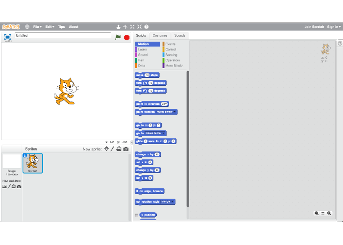
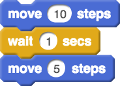
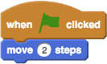
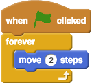
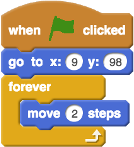
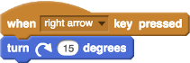
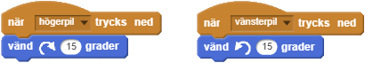
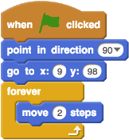
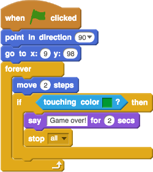
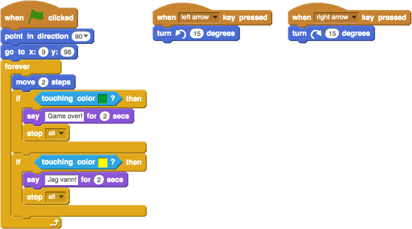

# Bug race - English

Let's build a racing game in Scratch.

### Scratch studio

First, we learn the different parts of Scratch:

- A script is multiple commands in sequence
- In Scratch, the commands appear as blocks
- The blocks should be together (like a puzzle)
- The computer reads the blocks from top to bottom

### Illustration

The computer first reads this as move 10 steps, then wait 1 second and lastly move 5 more steps.

**Proceed to the next step to start programming.**

## 1: Start programming

Let's open our game in Scratch studio:

**<a href="http://bit.ly/bugrace-vf" target="_blank">bit.ly/bugrace-vf</a>**

We have already drawn out a track and put out a beetle that you will steer. Also all the blocks needed are there.

> If you wonder _how_ or _why_ it works or if you have other questions, talk to one of the volunteers.

**Let's code!**

1. To get the beetle forward, we need to use the block <i class="sb">move 2 steps</i> and put it on the block <i class="sb">when  clicked</i>.

    

> Click the flag and see how the beetle moves forward each time you press.

Now we will get the beetle to move 2 steps forever.

2. We'll have to put <i class="sb">move 2 steps</i> in the block <i class="sb">forever</i>.
3. Then we put the new <i class="sb">forever</i> block back on the start block <i class="sb">when  clicked</i>.

    

> Click the flag and see how it goes all the way to the edge.

When we start the game again, the beetle does not start from the position we want. We must tell the computer that the beetle should go to a specific position when the green flag is clicked.

4. Put the block <i class="sb">go to x:9 y:98</i> between <i class="sb">when  clicked</i> and <i class="sb">forever</i>.

    

> Click the flag a few times and see how the beetle always starts from the same position.

Now we'll get the beetle to turn when we press the arrow keys.

5. When the right arrow key is pressed down we want the beetle to turn right so we put the block <i class="sb">turn right 15 degrees</i> on <i class="sb">when right arrow key pressed</i>

    

> Start the game and press the right arrow on the keyboard several times. The beetle turns to the right!

6. Do the same with <i class="sb">when left arrow key pressed</i> and <i class="sb">turn left 15 degrees</i>.

    

> Click the flag and use the right and left arrow keys to steer the beetle.

When you start the game now after a few times, you notice that the beetle points to different directions almost every time. We want the beetle to point forward each time we start.

7. Put the block <i class="sb">point in direction 90</i> between <i class="sb">when  clicked</i> and <i class="sb">go to x:9 y:98</i>.

    

> Click the flag and see how the beetle always points forward when you start.

It is now possible to drive around the track, but nothing happens when we drive off the track. If we go off the track, the game should say _Game over!_ and finish the game. The script needs to check every time the beetle moves 2 steps if we touch the color green (same as the grass) and then say _Game over!_ and stop the game (stop all scripts).

8. Put the block <i class="sb">touching color ?</i> on the empty box of the <i class="sb">if <> then</i> block.
9. Then put the blocks <i class="sb">say Game over! for 2 secs</i> and <i class="sb">stop all</i> into <i class="sb">if <> then</i>.
10. Lastly, put the whole <i class="sb">if <> then</i> block inside <i class="sb">forever</i> right after <i class="sb">move 2 steps</i>.

    

> Click on the flag and see what happens if you run off the track.

Now we are almost done. We just need to tell the game that we won when we reach the finish line (the yellow line).

In the same way that we checked if the beetle touched the green color, we want to check if the beetle is touching the yellow color instead. If it touches the yellow color we want to say _I won!_ and then stop the game.

11. See if you can figure out what to do for it to work as we want. When you're done, try clicking the flag and see if it works.

> On the next page you can see what the entire script looks like, but please try yourself first.

## 2: A finished game

Here's what the whole script looks like when it's done. It doesn't need to be exactly the same in all places as long as it works as you want.

**Nice work!**

## 3: Proceeding

You can continue to program at home or at school. For example, you can add some obstacles to the track and you can also make it a two player game. There is more to do and more information can be found on kodboken.se.

<h2 id="dummy"></h2>
